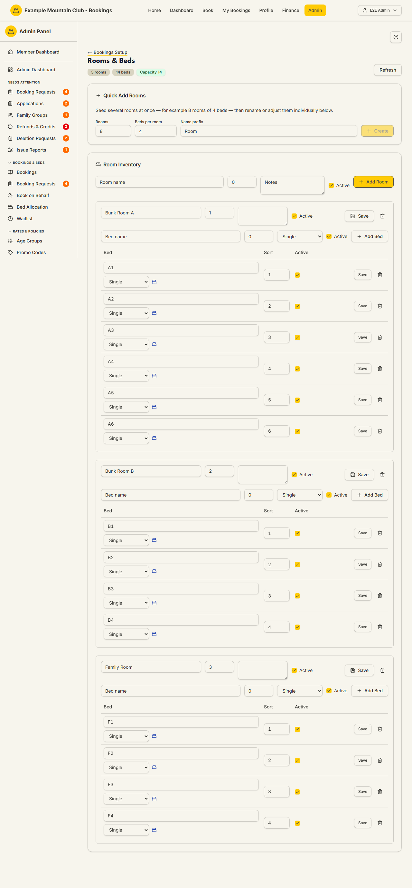

# Rooms & Beds

Audience: Operator

## What it is

The bed inventory for a lodge: the rooms it has, the beds in each room, and the
bed types (single, bunk, double). This inventory is what the club's bookable
capacity is summed from, and it is what the Bed Allocation board hands guests to.
Find it at `/admin/rooms-beds`. It has **no direct sidebar entry** — rooms and
beds are lodge-scoped (ADR-005), so you reach this page from the **lodge
configuration hub**'s **Rooms & Beds** card (**Admin → Setup & Configuration →
Lodges →** a lodge **→ Rooms & Beds**), which opens it already filtered to that
lodge. There is also a **← Bookings Setup** back-link at the top, because rooms
and beds are the physical side of booking setup.

Although this page lives in the **Lodge Operations** area, its data flows through
the bed-allocation APIs, which enforce the **bookings** permission area: you need
**bookings edit** to add or change rooms and beds, and a bookings view-only role
sees it read-only. The page appears only when the `bedAllocation` module is on.

## When you'd use it

- You are setting up a lodge's rooms and beds for the first time.
- You added a bunk room, converted singles to a double, or took a room offline
  for the season and need capacity to reflect it.
- You want to check the club's total bookable capacity, room by room.

## Step-by-step

### Open Rooms & Beds for a lodge

1. From the lodge configuration hub, open a lodge and click its **Rooms & Beds**
   card (or go to `/admin/rooms-beds`). The header shows three badges — the room
   count, a **beds** badge (the sum of the lodge's active beds, its physical
   inventory), and a **Capacity** badge. The two are **distinct quantities**: the
   beds badge is how many beds are installed, while **Capacity** is the *resolved*
   bookable figure — `min(active beds, the lodge's configured capacity ceiling)`.
   When the ceiling is unset or above the bed count the two match (and the badge is
   green); when the ceiling caps the beds the Capacity badge is lower and turns
   amber. The ceiling itself is **not** typed here — it is the lodge's capacity
   setting, edited on the lodge configuration page. See the
   [capacity model](../CAPACITY_MODEL.md#two-distinct-quantities).

   

### Seed several rooms at once

1. In **Quick Add Rooms**, set **Rooms** (how many), **Beds per room**, and a
   **Name prefix**, then click **Create**. This seeds the rooms and their beds in
   one go; rename or adjust them individually below.

### Add or edit a room

1. In **Room Inventory**, use the top row (**Room name**, a capacity number,
   **Notes**, **Active**) and click **+ Add Room**.
2. On an existing room, change its name, notes, or **Active** state and click
   **Save**. Deactivating a room takes its beds out of the bookable capacity but
   keeps them for history.

### Add or edit beds in a room

1. In a room, use the bed row (**Bed name**, a sort number, a **bed type**, and
   **Active**) and click **+ Add Bed**.
2. Choose the **bed type** — Single, Bunk (top), Bunk (bottom), or Double. Pair a
   bunk top with its bottom so the board groups them; a lone bunk shows a soft
   unpaired hint until you add its partner. Click **Save** on the row to store
   changes, or the trash icon to remove a bed.

## Settings reference

| Field | What it controls | Default | Notes / constraints |
| --- | --- | --- | --- |
| Rooms / Beds per room / Name prefix (Quick Add) | Seeds a batch of rooms and their beds | — | Integers; rename individually afterwards |
| Room name | The room's display name | — | Required; shown on the bed board and roster |
| Room capacity | The room's bed count field | — | Integer; the header **beds** badge sums this lodge's active beds. The separate **Capacity** badge is the resolved bookable figure — `min(active beds, the lodge's configured ceiling)` — not a room field |
| Room notes | A free-text note on the room | — | Optional |
| Room Active | Whether the room's beds count toward capacity | on | Inactive rooms are kept for history but not bookable |
| Bed name | The bed's label | — | Required; unique within its room |
| Bed sort | The bed's order within the room | — | Integer; controls list/board order |
| Bed type | Single, Bunk (top), Bunk (bottom), or Double | Single | A bunk top pairs with its bottom; a double adds partner-shared headroom (`CAPACITY_MODEL.md`) |
| Bed Active | Whether the bed counts toward capacity | on | Inactive beds are kept for history but not bookable |

> The **beds** badge and the **Capacity** badge are two different things (see the
> [capacity model](../CAPACITY_MODEL.md#two-distinct-quantities)). The beds badge
> is the physical inventory — every active bed across active rooms. **Capacity** is
> the resolved bookable figure: `min(active beds, the lodge's configured capacity
> ceiling)`. The ceiling is the lodge's capacity setting (typed on the lodge
> configuration page, not here); leave it unset and Capacity simply follows the
> bed count. A lodge can legitimately have more installed beds than it may sleep —
> e.g. 10 beds with an 8 ceiling makes the Capacity badge read **8**, and the page
> warns that the extra beds stay available for allocation but cannot be booked
> into. See the model for how doubles and overrides combine on top.

## Troubleshooting

| Symptom | Likely cause | Fix |
| --- | --- | --- |
| I can't find Rooms & Beds in the sidebar | It has no direct sidebar entry (lodge-scoped) | Open **Lodges → [a lodge] → Rooms & Beds**, from **Bookings Setup**, or go to `/admin/rooms-beds` |
| The whole page is read-only | Your admin role has bookings view but not edit | Ask a full admin for **bookings edit** access (rooms/beds use the bed-allocation APIs) |
| The page 404s / is missing | The `bedAllocation` module is off | Enable it under **Admin → Setup → Modules** — see [`CONFIGURATION.md`](../../CONFIGURATION.md#module-controls-and-admin-modules) |
| Capacity looks too low/high | A room or bed is inactive, or a double/bunk is counted differently than expected | Check each room's and bed's **Active** state and bed types against the [capacity model](../CAPACITY_MODEL.md) |
| Capacity is **lower than the beds badge**, and the page warns "Sleeping capacity capped below the installed beds" | The lodge's configured capacity ceiling is below the active bed count, so Capacity = the ceiling (`capped_beds`). The surplus beds stay allocatable but cannot be booked into | Intended? Leave it. To lift the cap, raise or clear the lodge's capacity on the **lodge configuration page** ([Lodges](lodges.md)) — see [the capacity model](../CAPACITY_MODEL.md#two-distinct-quantities) |
| The page warns "Capacity fallback active" and uses the lodge's capacity setting | Bed Allocation is on but **no active beds** are configured, so bookable capacity falls back to the lodge's capacity setting until at least one active bed exists | Add at least one active bed here, or set the fallback capacity on the [Lodges](lodges.md) configuration page |
| A bunk shows an "unpaired" hint | Its partner bunk bed has not been added yet | Add the matching Bunk (top)/(bottom) bed in the same room |

## Related links

- Back to the [documentation hub](../README.md).
- Feature hub: [Multi-lodge support](../multi-lodge/README.md).
- Sibling guides: [Bed Allocation](bed-allocation.md), [Bookings Setup](bookings-setup.md),
  [Chores](chores.md), [Lodges](lodges.md).
- Reference: the [capacity model](../CAPACITY_MODEL.md#two-distinct-quantities),
  the [Booking Dates And Capacity](../DOMAIN_INVARIANTS.md#booking-dates-and-capacity)
  invariants, and the [Admin and Lodge](../ARCHITECTURE.md#admin-and-lodge)
  architecture.
