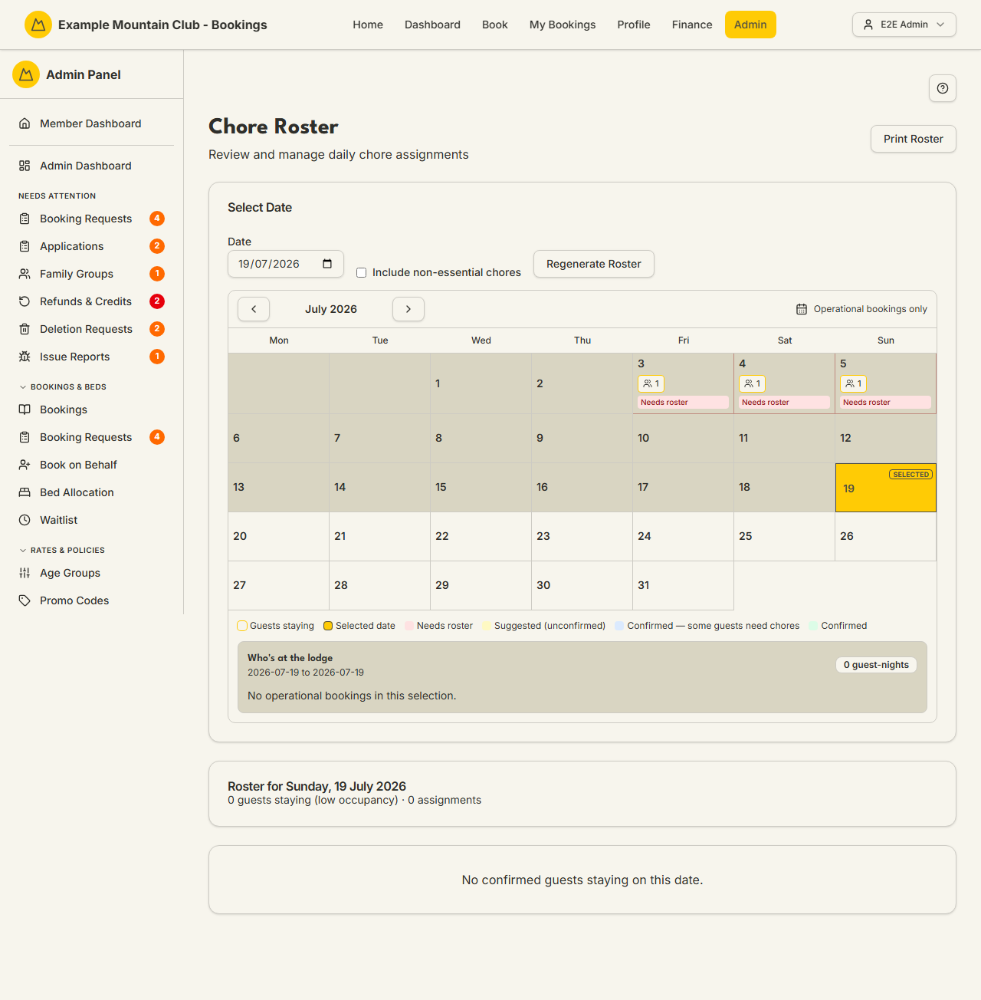

# Chore Roster

Audience: Operator

## What it is

The daily board that assigns staying guests to the lodge's chores for a chosen
night. It auto-suggests a roster from your [chore templates](chores.md) and who is
staying, lets you tweak it, confirm it, print it, and email each guest their
chores. Find it at **Admin → Lodge Operations → Roster** (`/admin/roster`).

The roster is a **lodge** permission area: lodge view to read, lodge **edit** to
generate, reassign, confirm, or email. The page appears only when the `chores`
module is on.

## When you'd use it

- A group is arriving and you want a chore roster ready for the night.
- You need to reassign a chore because someone left early or a child can't do it.
- You want to email everyone their chores, or print the roster for the lodge wall.

## Step-by-step

### Pick a night

1. Go to **Admin → Lodge Operations → Roster**. Use the **Date** field or the
   calendar to choose a night. The calendar colours each night by roster status —
   **Needs roster**, **Suggested (unconfirmed)**, **Confirmed — some guests need
   chores**, and **Confirmed** — and the **Who's at the lodge** panel shows who is
   staying.

   

### Generate and adjust the roster

1. Click **Regenerate Roster** to auto-suggest assignments for the selected night.
   Tick **Include non-essential chores** first if you want the optional chores in
   as well. Regenerating a confirmed roster asks you to confirm — it replaces the
   confirmed roster with a fresh editable suggestion.
2. On each chore card, use the per-row **guest** dropdown to reassign, **Remove**
   to drop a person, or **+ Add Person** to add one. Chores with no one on them
   appear under **Unrostered Chores** — click one to add it.

### Confirm, email, and print

1. Click **Confirm Roster** to mark all suggested assignments final.
2. Click **Email Roster to Guests** to send each affected guest their chores. A
   dialog lets you choose to **email** (which issues each guest a fresh 48-hour
   chore link) or **not email** (which sends nothing and leaves any previously
   sent chore links valid). Guests who opted out of chore-roster emails are always
   skipped. Only the **suppression** choice is written to the audit log (as
   "Admin suppressed the chore-roster email send"); an ordinary send leaves no
   audit record, by design.
3. Use **Print Roster** (top right) for a printable sheet for the lodge wall.

## Settings reference

| Control | What it does | Notes / constraints |
| --- | --- | --- |
| Date / calendar | Selects the night the roster is for | NZ date-only lodge nights |
| Include non-essential chores | Adds optional chores when regenerating | Off by default; essential chores always included |
| Regenerate Roster | Auto-suggests assignments for the night | Overwrites a confirmed roster only after you confirm |
| Guest dropdown / Remove / + Add Person | Reassigns, removes, or adds an assignment | Requires lodge edit |
| Confirm Roster | Marks all suggested assignments final | Assignments then read CONFIRMED |
| Email Roster to Guests | Emails each affected guest their chores | Issues fresh 48-hour chore links; opted-out guests skipped; only the suppress choice is audited (a send is not) |
| Print Roster | Opens a printable roster for the date | Opens in a new tab; respects the lodge filter |
| Lodge selector | Which lodge's roster you see | Only shown with more than one active lodge |

## Troubleshooting

| Symptom | Likely cause | Fix |
| --- | --- | --- |
| The page 404s / Roster is missing from the sidebar | The `chores` module is off | Enable it under **Admin → Setup → Modules** — see [`CONFIGURATION.md`](../../CONFIGURATION.md#module-controls-and-admin-modules) |
| Everything is read-only ("… can view the chore roster but cannot change it") | Your admin role has lodge view but not edit | Ask a full admin for **lodge edit** access |
| "No confirmed guests staying on this date" | No confirmed booking covers that night | Pick a night with guests, or check the booking is confirmed |
| "No chore assignments for this date" | The roster hasn't been generated yet | Click **Regenerate Roster** to auto-suggest |
| A confirmed night still says some guests need chores | A staying booking has no chore on it | Click **Regenerate Roster** to include it, or **+ Add Person** on a chore |
| A guest didn't get the email | They opted out of chore-roster emails, or delivery failed | Opted-out guests are skipped by design; check [Email Deliverability](email-deliverability.md) for failures |

## Related links

- Back to the [documentation hub](../README.md).
- Sibling guides: [Chore Templates](chores.md), [Hut Leaders](hut-leaders.md),
  [Rooms & Beds](rooms-beds.md), [Lodge Kiosk](lodge.md).
- Reference: the roster/chores model in
  [Admin and Lodge](../ARCHITECTURE.md#admin-and-lodge).
