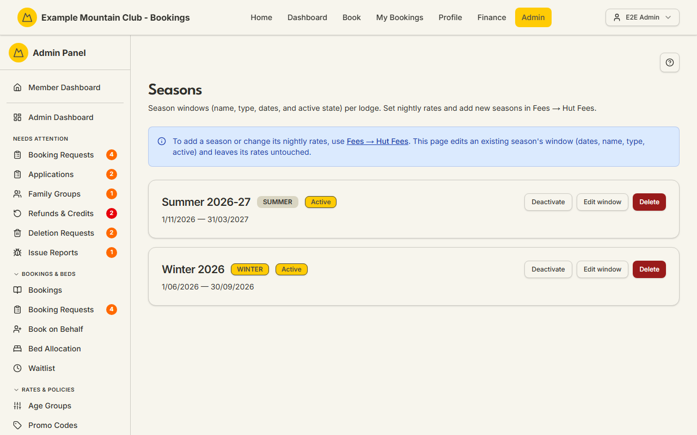

# Seasons

Audience: Operator

## What it is

The page that edits an existing **season window** — its name, type (Winter or
Summer), start and end dates, and whether it is active — for each lodge. Seasons
decide which nightly rates apply on a given night. Find it at
`/admin/seasons`.

There is no direct link in the admin sidebar: reach this page from **Fees → Hut
Fees** (or the lodge hub's "Seasons & Rates" card), or go straight to
`/admin/seasons`. That placement is deliberate — you **add** a season and set
its **nightly rates** in **Fees → Hut Fees**; this page only adjusts the dates
and metadata of a season that already exists, and never touches its rates.

Editing seasons needs **bookings edit** access; a view-only bookings role can
inspect the windows but not change them. Dates are NZ date-only lodge nights.

## When you'd use it

- Winter or summer starts or ends on a different date this year and you need to
  move a season's window.
- You want to activate or deactivate a season, or rename it.
- You are checking which season currently covers a set of dates.

## Step-by-step

### Review the season windows

1. Go to `/admin/seasons` (from **Fees → Hut Fees**). The page lists each
   season as a card with its type badge (WINTER/SUMMER), an Active/Inactive
   badge, and its date range.

   

2. If the club runs more than one lodge, use the lodge selector to switch which
   lodge's seasons you see.

### Edit a season window

1. On a season card, click **Edit window**.
2. Change the **Season Name**, **Type** (Winter or Summer), **Start Date**,
   **End Date**, or the **Active** checkbox. Rates are not shown here and are
   left unchanged.
3. Click **Update Season**.

### Activate, deactivate, or delete

1. Use **Deactivate**/**Activate** on a card to toggle whether the season is
   live, or **Delete** to remove it (you will be asked to confirm).

### Add a season or change rates

1. To add a new season or change nightly rates, go to **Fees → Hut Fees** — the
   in-page notice links there. This Seasons page cannot create seasons or edit
   rates.

## Settings reference

| Field | What it controls | Default | Notes / constraints |
| --- | --- | --- | --- |
| Season Name | The season's display name | — | Required; e.g. "Winter 2026" |
| Type | Winter or Summer | Winter | Drives which seasonal rates apply |
| Start Date / End Date | The season window | — | Required; NZ date-only |
| Active | Whether the season is live | on | Inactive seasons are dimmed in the list |
| Lodge selector | Which lodge's seasons are shown | first/only lodge | Only shown with more than one active lodge |

> Nightly rates are **not** on this page. Add seasons and set rates in **Fees →
> Hut Fees**; this page edits an existing season's window only.

## Troubleshooting

| Symptom | Likely cause | Fix |
| --- | --- | --- |
| I can't find Seasons in the sidebar | It has no direct sidebar entry | Open **Fees → Hut Fees** and use the Seasons & Rates card, or go to `/admin/seasons` |
| I can't change the nightly rate here | This page edits windows only, not rates | Change rates in **Fees → Hut Fees** |
| The Edit form is missing | Your admin role is view-only for bookings | Ask a full admin for bookings edit access |
| "No seasons configured yet" | This lodge has no seasons | Add one in **Fees → Hut Fees** |
| Rates look wrong for a date | The date falls in a different (or inactive) season than expected | Check each season's window and Active state |

## Related links

- Back to the [documentation hub](../README.md).
- Sibling guides: [Booking Policies](booking-policies.md),
  [Age Groups](age-tier-settings.md), [Promo Codes](promo-codes.md).
- Reference: the
  [fee configuration lifecycle](../STATE_MACHINES.md#fee-configuration-lifecycle),
  the fee operator workflow in
  [`AUTHORITATIVE_FEES.md`](../AUTHORITATIVE_FEES.md#operator-workflow), and the
  [core data model](../ARCHITECTURE.md#core-data-model).
