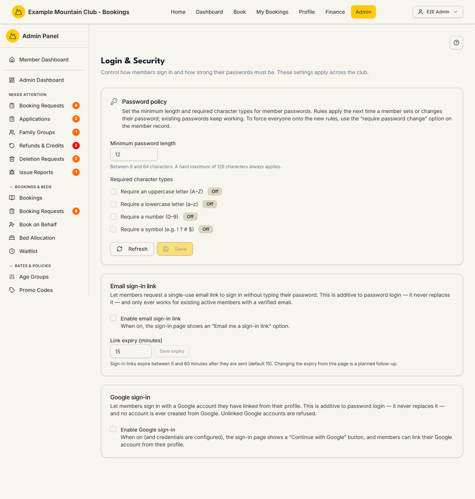

# Login & Security

Audience: Operator

## What it is

The club-wide controls for how members and admins sign in and how strong their
passwords must be: a **password policy** card, an **email sign-in link**
(magic-link) card, and a **Google sign-in** card. Find it at **Admin → Setup &
Configuration → Login & Security** (`/admin/security`).

The page sits under the **support** ("Support & System") permission area. The
sign-in method cards are tied to their modules — the magic-link and Google cards
configure the `magicLink` and `googleLogin` modules you enable on
[Modules](modules.md). See [`SECURITY.md`](../SECURITY.md) and the
[disclosure policy](../../SECURITY.md) for the wider security posture.

## When you'd use it

- You want to raise password strength requirements for the whole club.
- You're rolling out passwordless email sign-in links and need to set (or check)
  their expiry.
- You're enabling Google sign-in and want to confirm the server credentials are
  in place before members see the button.

## Step-by-step

### Set the password policy and sign-in options

1. Go to **Admin → Setup & Configuration → Login & Security**.

   

   Each of the three cards opens read-only. To change anything, use the card's
   **Edit** button, make your changes, then **Save** (or **Cancel** to discard
   them) — nothing is applied until you save. If your admin role can view but not
   change these settings, the Edit button is disabled and a short "view only"
   note appears.

2. In **Password policy**, click **Edit**, set the strength requirements that
   apply to every member and admin password, then **Save**.
3. In **Email sign-in link**, click **Edit**, confirm the enable toggle is on,
   set the link's expiry (a whole number of minutes between 5 and 60; default
   15), then **Save**. In **Google sign-in**, click **Edit**, confirm the enable
   toggle is on, then **Save**; the sign-in button only appears once the
   `googleLogin` module is on **and** the server-side Google credentials are
   configured.

## Settings reference

| Setting | What it controls | Notes / constraints |
| --- | --- | --- |
| Password policy | Minimum strength requirements for all passwords | Applies club-wide, across members and admins |
| Email sign-in link (magic link) | Passwordless single-use email sign-in | Requires the `magicLink` module and configured transactional email; additive to password login, never a replacement, for existing verified members only |
| Magic-link expiry | How long a sign-in link stays valid | Default 15 minutes |
| Google sign-in | Sign in with a linked Google account | Requires the `googleLogin` module **and** `GOOGLE_CLIENT_ID`/`GOOGLE_CLIENT_SECRET` server-side; a member links their own Google account from their profile; no account is ever created from Google |

Two-factor authentication is a related sign-in control, but it is switched on as
the `twoFactor` module on [Modules](modules.md).

## Troubleshooting

| Symptom | Likely cause | Fix |
| --- | --- | --- |
| The email sign-in card is inert | The `magicLink` module is off, or email delivery isn't configured | Enable it on [Modules](modules.md); configure transactional email in [`CONFIGURATION.md`](../../CONFIGURATION.md) |
| No Google button appears for members | The `googleLogin` module is off, or the server credentials aren't set | Enable the module and set `GOOGLE_CLIENT_ID`/`GOOGLE_CLIENT_SECRET` |
| A member can't sign in with Google | Their Google account isn't linked | They link it from their own profile while signed in; unlinked accounts are refused |
| Settings won't save | Your role lacks support edit access | Ask a full admin for support edit access |

## Related links

- Back to the [documentation hub](../README.md).
- Sibling guides: [Modules](modules.md), [Access Roles](access-roles.md),
  [Setup](setup.md).
- Reference: [`SECURITY.md`](../SECURITY.md) and the
  [security disclosure policy](../../SECURITY.md).
