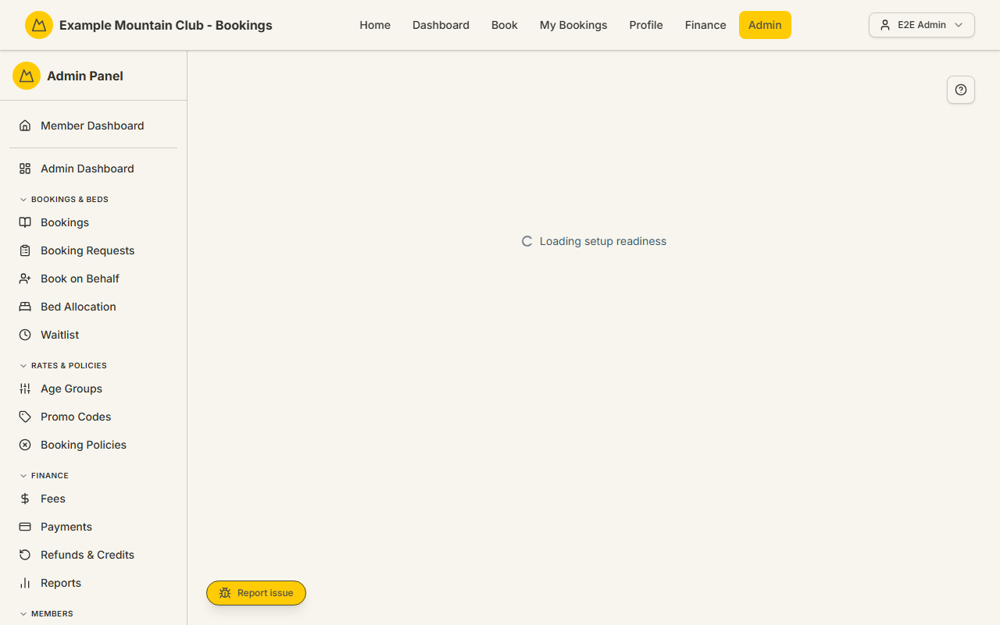

# Setup

Audience: Operator

## What it is

The installation and configuration hub: a **readiness checklist** that grades
your club's setup (with live provider tests for Stripe, SMTP, Sentry, and Xero)
plus a grid of **hub cards** that jump into each configuration area — initial
setup, finance, booking rules, integrations, membership, cancellation, and
notifications. Find it at **Admin → Setup & Configuration → Setup**
(`/admin/setup`).

The page's own route is the **support** area, but it embeds cross-area cards
whose backing pages enforce their own permission areas — so which cards you can
open depends on your role. It is the natural starting point after a fresh
install and the map to everything else in Setup & Configuration.

## When you'd use it

- You've just stood up a fork and want a guided checklist of what still needs
  configuring.
- You want to test that Stripe, email (SMTP), Sentry, or Xero are actually
  reachable from this environment.
- You need to find the right configuration sub-area and don't want to hunt the
  sidebar.

## Step-by-step

### Work the checklist and jump to a sub-area

Each hub card opens an aggregator surface that regroups settings owned and
documented in their own areas' guides, so this hub's single screenshot is
enough — every sub-page is captured and detailed where it lives.

1. Go to **Admin → Setup & Configuration → Setup**. The readiness summary shows
   how many checks are complete, warning, or blocked.

   

2. Work through the **checklist categories**. A check can be marked done or
   skipped, and provider checks offer a **test** button (Stripe, SMTP, Sentry,
   Xero) that pings the live service and reports the result.
3. Use the **hub cards** to open a configuration area: Initial Setup, Finance,
   Booking Rules, Operational Integrations, Membership & Members, Cancellation,
   or Email Messages / Notifications.

## Settings reference

The Setup page itself only tracks checklist progress; the real settings live in
the areas it links to:

| Hub card | Opens | Its permission area |
| --- | --- | --- |
| Initial Setup | Install checklist, club identity, modules, lodge records, health (`/admin/setup/foundations`) | support |
| Finance | Finance reporting, Xero setup, sync tools, report mappings — collapsed by default (`/admin/setup/finance`) | finance |
| Booking Rules | Booking policy, seasons, age groups, promos, inventory, copy (`/admin/setup/booking-rules`) | bookings, lodge |
| Operational Integrations | Provider readiness, Xero connection, modules, delivery health (`/admin/setup/integrations`) | support, finance |
| Membership & Members | Membership types, member fields, subscription lockout ([membership-setup](membership-setup.md)) | membership |
| Cancellation | Cancellation settings, request queues, message copy (`/admin/setup/cancellation`) | membership, support |
| Email Messages / Notifications | Delivery rules, recipients, templates, member copy ([notifications](notifications.md)) | support |

Provider tests cover Stripe, SMTP (email), Sentry, and Xero. Each check is
**complete**, **warning**, **blocked**, or **not started**.

One checklist step does not sit behind a hub card, because it is a single
setting: **Club Time Zone** links straight to [`/admin/club-time`](club-time.md).
On a fresh install it reads **blocked** until a time zone is recorded, so setup
cannot be finished without one. After an upgrade it usually reads *complete* and
names the zone — the application records the zone it was already effectively
using the first time it starts, so nothing needs choosing.

Two other answers are worth recognising. A **warning** means the zone could not be
confirmed: the server's `TZ` named no actual place (`UTC`, `Etc/UTC`), so
`Pacific/Auckland` was recorded and the checklist is asking you to confirm it —
act on this one if the club is not in New Zealand. Still **blocked** after an
upgrade means the application has not restarted since the migration; restart it,
or run `npm run config:self-heal`.

## Troubleshooting

| Symptom | Likely cause | Fix |
| --- | --- | --- |
| A provider test fails | The credentials/config for that provider are missing or wrong | Fix them per [`CONFIGURATION.md`](../../CONFIGURATION.md); re-run the test |
| A hub card is missing or greyed | Your role lacks the card's permission area | Ask a full admin, or an admin with that area, to complete it |
| A check stays "blocked" | A required dependency isn't in place | Open the linked area and resolve the named requirement |
| **Club Time Zone** stays blocked right after an upgrade | The application has not restarted since the migration, so the zone has not been recorded yet. The zone in use is still the right one | Restart the application, or run `npm run config:self-heal`. See the [Club Time Zone guide](club-time.md) |
| **Club Time Zone** shows a warning about confirming the zone | The server's `TZ` named no actual place, so `Pacific/Auckland` was recorded rather than guessed at from a value that names no location | If the club is in New Zealand, acknowledge the step. If not, set the real zone at [`/admin/club-time`](club-time.md) — this is the case that would otherwise put a non-NZ club's times out by hours |
| Setup shows incomplete after go-live | Optional checks were left unskipped | Mark genuinely-skipped checks as skipped so the summary reflects reality |

## Related links

- Back to the [documentation hub](../README.md).
- Sibling guides: [Modules](modules.md), [Integrations](integrations.md),
  [Login & Security](security.md), [Membership & Members setup](membership-setup.md),
  [Notifications & Email](notifications.md), [Club Time Zone](club-time.md).
- Reference: [`CONFIGURATION.md`](../../CONFIGURATION.md) and the
  [`IMPLEMENTATION_GUIDE.md`](../IMPLEMENTATION_GUIDE.md).
