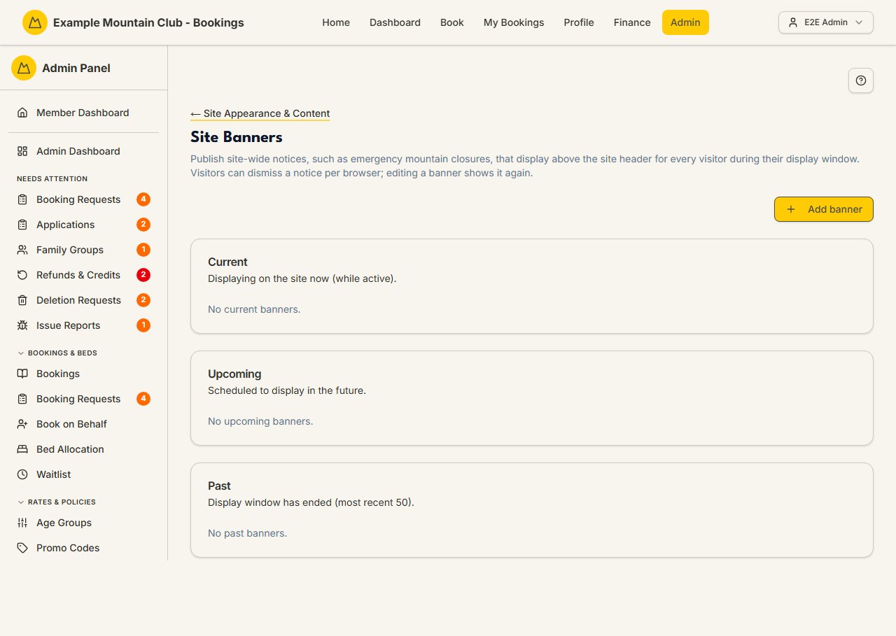

# Site Banners

Audience: Operator

## What it is

A publisher for dated notice banners that display above the site header for
every visitor during a scheduled window — for example an emergency mountain
closure or a maintenance heads-up. Find it at **Admin → Setup & Configuration →
Site Appearance & Content → Site Banners** (`/admin/site-banners`). It has no
direct sidebar entry — open it from the **Site Banners** card on the Site
Appearance & Content hub.

Visitors can dismiss a notice per browser; editing a banner shows it again to
everyone. Banners are edited under the **content** permission area.

## When you'd use it

- The mountain road is closed and you want every visitor to see it immediately.
- You want to schedule a notice in advance (e.g. a booking-system maintenance
  window) so it appears and disappears on set dates.
- A live notice needs its wording or dates corrected.

## Step-by-step

### Add a banner

1. Open **Site Banners**. Existing banners are grouped into **Current**
   (displaying now while active), **Upcoming** (scheduled), and **Past**
   (window ended — most recent 50).

   

2. Click **Add banner**. In the dialog, write the **Message** (up to 500
   characters), pick a **Priority** (Urgent, Warning, or Notify), and set the
   **Start date** and **End date** (NZ date-only, `YYYY-MM-DD`). Leave **Active**
   ticked to have it show inside its window.
3. Save. The banner appears in the matching group and, once its window opens and
   it is active, above the public site header. Use the pencil to **edit** or the
   trash icon to **delete** a banner; editing re-shows a banner to visitors who
   dismissed it.

## Settings reference

| Setting | What it controls | Default | Notes / constraints |
| --- | --- | --- | --- |
| Message | The banner text shown to visitors | Empty | Required, up to 500 characters (`SITE_BANNER_MESSAGE_MAX_LENGTH`) |
| Priority | The banner style/severity | Notify | One of **Urgent**, **Warning**, **Notify** |
| Start date | First day the banner displays | Empty | NZ date-only (`YYYY-MM-DD`) |
| End date | Last day the banner displays | Empty | NZ date-only (`YYYY-MM-DD`) |
| Active | Whether the banner shows inside its window | On | Untick to keep a banner without displaying it |

## Troubleshooting

| Symptom | Likely cause | Fix |
| --- | --- | --- |
| A banner isn't showing on the site | Today is outside its start/end window, or it's not active | Check the dates and the **Active** toggle |
| A visitor says the banner vanished | They dismissed it in their browser | Edit (and re-save) the banner to re-show it to everyone |
| The banner is in **Past** but I still need it | Its end date has passed | Edit it and extend the end date |
| Everything is read-only | Your admin role can view but not edit under the content area | Ask a full admin for content edit access |

## Related links

- Back to the [documentation hub](../README.md).
- Parent hub: [Site Appearance & Content](appearance.md).
- Sibling guides: [Page Content](page-content.md),
  [Mountain Conditions](mountain-conditions.md).
- Reference: the `SiteBanner` model and display behaviour in
  [`ARCHITECTURE.md`](../ARCHITECTURE.md).
