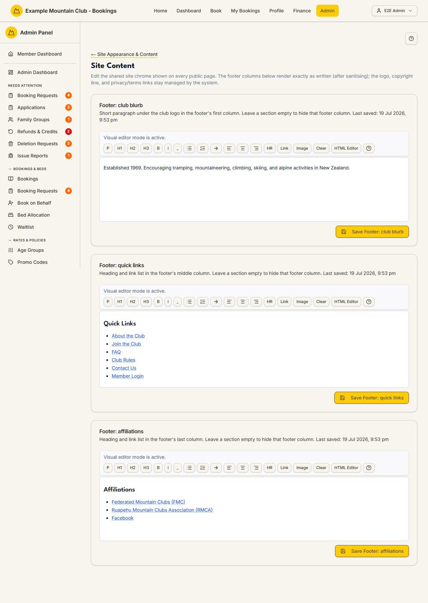

# Site Content

Audience: Operator

## What it is

An editor for the shared site chrome shown on **every** public page — the three
footer columns. Find it at **Admin → Setup & Configuration → Site Appearance & Content
→ Site Content** (`/admin/site-content`). It has no direct sidebar entry — open
it from the **Site Content** card on the Site Appearance & Content hub.

The footer columns render exactly as written (after sanitising); the logo,
copyright line, and privacy/terms links stay managed by the system and are not
editable here. Site Content is edited under the **content** permission area.

## When you'd use it

- You want to change the short club blurb, quick-links list, or affiliations
  shown in the site footer.
- You need to hide one footer column entirely.
- Your affiliation links or member-login wording changed.

## Step-by-step

### Edit a footer column

1. Open **Site Content**. Each footer column has its own rich-text editor:
   **Footer: club blurb** (first column), **Footer: quick links** (middle
   column), and **Footer: affiliations** (last column). The **Last saved**
   timestamp shows above each.

   

2. Edit the content in the editor. Toggle **HTML Editor** to edit the raw HTML,
   or stay in the visual editor (headings, bold/italic, lists, links, images,
   horizontal rule, alignment). Use **Clear** to empty a column.
3. Click the column's **Save** button (e.g. **Save Footer: club blurb**). To
   hide a footer column, leave its section empty and save.

## Settings reference

| Section | What it controls | Notes / constraints |
| --- | --- | --- |
| Footer: club blurb | The short paragraph under the club logo in the footer's first column | Leave empty to hide that column; HTML sanitised on save |
| Footer: quick links | The heading and link list in the footer's middle column | Leave empty to hide that column |
| Footer: affiliations | The heading and link list in the footer's last column | Leave empty to hide that column |
| Logo / copyright / privacy & terms links | System-managed footer elements | **Not editable here** |

Each column's content HTML is capped by the shared `SITE_CONTENT_LIMITS` (the
same cap the configuration export/import enforces), and every column's key is
one of the recognised `SITE_CONTENT_KEYS`.

## Troubleshooting

| Symptom | Likely cause | Fix |
| --- | --- | --- |
| A footer column disappeared from the public site | Its section was saved empty | Re-add content and save; empty hides the column by design |
| Formatting looks different on the public site | The HTML was sanitised on save | Use the allowed tags shown in the toolbar; check the HTML Editor view |
| Everything is read-only | Your admin role can view but not edit under the content area | Ask a full admin for content edit access |
| Save is rejected as too long | The content exceeds the `SITE_CONTENT_LIMITS` cap | Shorten the column content |

## Related links

- Back to the [documentation hub](../README.md).
- Parent hub: [Site Appearance & Content](appearance.md).
- Sibling guides: [Page Content](page-content.md),
  [Site Style](site-style.md), [Image Manager](image-manager.md).
- Reference: publishing authoritative content blocks and tokens in
  [`PUBLIC_PAGE_CONTENT_TOKENS.md`](../PUBLIC_PAGE_CONTENT_TOKENS.md).
