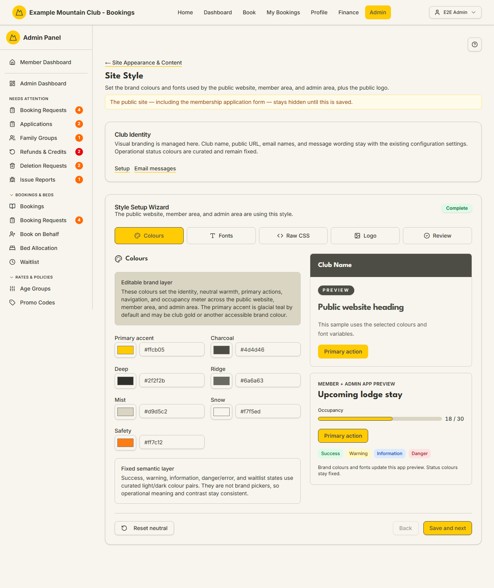

# Site Style

Audience: Operator

## What it is

A wizard that sets the brand colours and fonts used by the public website,
member area, and admin area, plus the public logo. Find it at **Admin →
Setup & Configuration → Site Appearance & Content → Site Style**
(`/admin/site-style`). It has no direct sidebar entry — open it from the
**Site Style** card on the Site Appearance & Content hub.

Site Style is a first-run gate: **the public site — including the membership
application form — stays hidden until this style is saved once.** After that,
edits take effect as soon as you save. It is edited under the **content**
permission area.

## When you'd use it

- You've just forked the platform and need to complete the style before the
  public site will show at all.
- Your club is rebranding — new colours, fonts, or logo.
- You want to preview how a colour change looks in the member and admin app
  before committing it.

## Step-by-step

### Work through the style wizard

1. Open **Site Style**. The **Style Setup Wizard** has five steps across the
   top: **Colours**, **Fonts**, **Raw CSS**, **Logo**, and **Review**. A
   **Complete** badge shows once the style has been saved.

   

2. On **Colours**, set the three **seed** colours as hex values: **Primary
   accent** (required — your club's brand colour), and optionally **Neutral
   character** (tints the grey ramp toward a hue; leave it to pair a plain grey
   with your accent) and **Support accent** (an optional secondary highlight).
   A vendored Radix colour generator turns those seeds into the full light/dark
   palette — one neutral ramp, your accent, an optional support, and the four
   semantic hues — with cross-colour text contrast guaranteed by construction.
   The live preview on the right shows a public heading and the member/admin app
   painted from exactly the palette that will ship. The **fixed semantic layer**
   (success, warning, information, danger, and waitlist states) is curated and is
   **not** editable, so operational meaning and contrast stay consistent. Use
   **Reset neutral** to clear the neutral-character seed.

   Because contrast is now guaranteed by the generator, a low-contrast seed is
   never rejected: the wizard **saves it and discloses the colours it adjusted**
   (a before → after swatch pair) rather than blocking the save. Colour input is
   **hex only**.

   Secondary text in the member and admin app — small labels, hints, and
   footnotes — is not one of the colours you pick. It is worked out from the
   generated neutral ramp as a softer version of the main text colour, so it
   reads as clearly secondary without becoming hard to read. Before it ships, the
   app measures that softer tone against the backgrounds secondary text actually
   sits on — your page and card background, your tinted-row background, and the
   four built-in coloured notice panels (warning, information, success, and
   danger) — and pulls it back toward the main text colour if it would otherwise
   fall below the accessibility minimum on any of them. Hairlines and dividers
   are not in that list, because text is not meant to sit on a divider.
3. Use **Save and next** to move through **Fonts** (the public and app font
   choices), **Raw CSS** (advanced custom CSS), and **Logo** (upload the public
   logo).
4. On **Review**, confirm and save. The public site becomes visible once the
   style is saved.

## Settings reference

| Wizard step | What it controls | Notes / constraints |
| --- | --- | --- |
| Colours — Primary accent | The main accent for actions and navigation; seeds every accent surface | Hex, **required**; glacial teal by default, may be club gold or another brand colour |
| Colours — Neutral character | Tints the generated grey ramp toward this hue | Hex, **optional**; leave unset to pair a plain grey with the accent |
| Colours — Support accent | An optional secondary highlight accent | Hex, **optional**; leave unset to omit a support colour |
| Fixed semantic layer | Success, warning, information, danger/error, and waitlist states | **Not editable** — curated light/dark pairs |
| Fonts | The public and app font variables | Chosen from the wizard |
| Raw CSS | Advanced custom CSS overrides | Optional; for advanced users |
| Logo | The public logo image | Uploaded on the Logo step |

## Troubleshooting

| Symptom | Likely cause | Fix |
| --- | --- | --- |
| The public site (and application form) shows nothing | The style has never been saved | Complete the wizard and save once; the **Complete** badge confirms it |
| A status colour won't change | Success/warning/information/danger are the fixed semantic layer | These are intentionally not brand pickers |
| Everything is read-only | Your admin role can view but not edit under the content area | Ask a full admin for content edit access |
| A colour looks low-contrast in the preview | The generator adjusted a pathological seed so the shipped scale stays accessible | This is expected — the wizard discloses the before → after adjustment; the preview and the swatch pair show what actually ships |
| A configuration bundle from an older app won't import | Bundles moved to **format version 2** (three seeds) | Re-export from an app on this version; version 1 bundles are refused rather than importing stale colour columns |

## Related links

- Back to the [documentation hub](../README.md).
- Parent hub: [Site Appearance & Content](appearance.md).
- Sibling guides: [Site Content](site-content.md),
  [Page Content](page-content.md), [Image Manager](image-manager.md).
