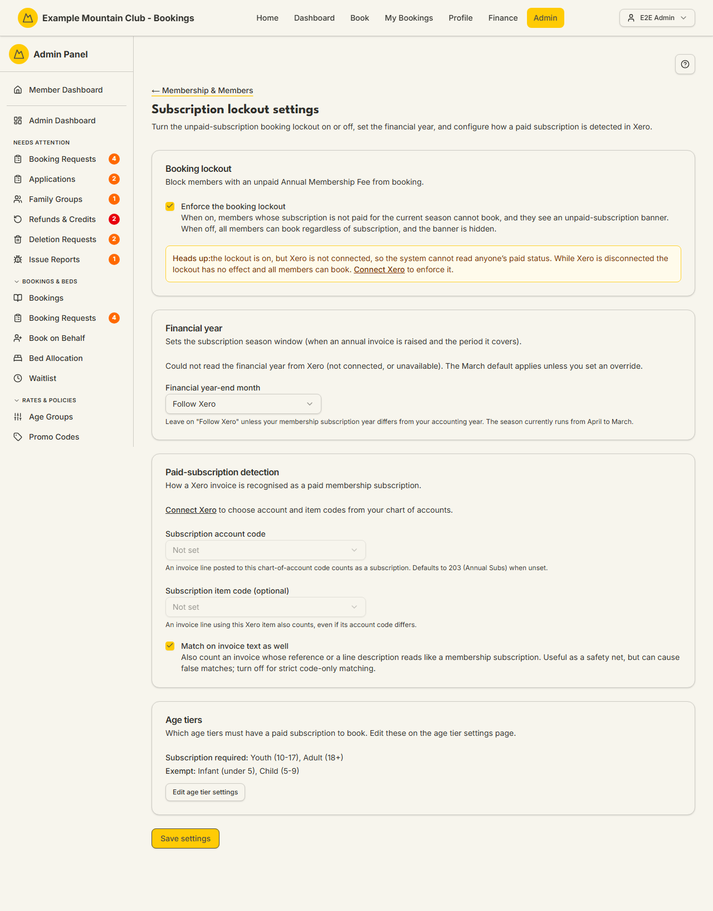

# Subscription Lockout

Audience: Operator

## What it is

The page that decides whether members who have not paid their Annual Membership
Fee are blocked from booking, sets the club's financial-year window, and
configures how a paid subscription is recognised from Xero. Find it at **Admin →
Setup & Configuration → Membership & Members → Subscription Lockout**
(`/admin/subscription-lockout`); it has no direct sidebar entry — reach it through
the [Membership & Members setup hub](membership-setup.md).

**Opening this page requires *support*-area view access** — the route is
admitted under the support permission area, and an admin without it is
redirected away even though the hub card is still visible. Once inside, the
sections span three further permission areas: the lockout switch, financial
year, and text-match fallback are **membership** settings; the Xero
account/item detection codes are **finance** settings; and the per-age-tier
requirement is a read-only view of the **bookings** age-tier settings. You only
see and can edit the sections your role covers, and **Save** only writes the
parts you can change.

## When you'd use it

- You want to start (or stop) blocking unpaid members from booking.
- Your membership subscription year differs from your Xero accounting year and you
  need to override the financial year-end month.
- Xero posts subscription invoices to a particular account or item code and you
  want the system to recognise them as "paid".

## Step-by-step

### Turn the lockout on or off

1. Go to **Subscription Lockout** (via **Membership & Members**). In **Booking
   lockout**, tick **Enforce the booking lockout** to block members whose
   current-season subscription is not paid.

   

2. If the lockout is on but Xero is not connected, a warning explains the lockout
   has no effect (paid status can only come from Xero) and links to **Connect
   Xero**.

### Set the financial year

1. In **Financial year**, leave **Financial year-end month** on **Follow Xero**
   unless your membership year differs from your accounting year. Choosing an
   explicit month changes how every subscription season is calculated (existing
   records are not migrated).

### Configure paid-subscription detection (finance)

1. In **Paid-subscription detection**, pick the **Subscription account code**
   (an invoice line posted to it counts as a subscription; defaults to 203 Annual
   Subs when unset) and optionally a **Subscription item code**.
2. Tick **Match on invoice text as well** to also count invoices whose reference
   or line description reads like a subscription (a safety net that can cause
   false matches — leave off for strict code-only matching).

### Review the age-tier rule

1. The **Age tiers** card shows which age tiers require a paid subscription and
   which are exempt. Click **Edit age tier settings** to change them (that is the
   [Age Groups](age-tier-settings.md) page).
2. Click **Save settings**.

## Settings reference

| Setting | Area | What it controls | Default | Notes / constraints |
| --- | --- | --- | --- | --- |
| Enforce the booking lockout | Membership | Block unpaid members from booking | from server | No effect while Xero is disconnected |
| Financial year-end month | Membership | The subscription season window | Follow Xero (→ March) | Override changes all seasons; records not migrated |
| Match on invoice text as well | Membership | Text fallback for detecting a paid subscription | from server | Can cause false matches |
| Subscription account code | Finance | Which Xero account counts as a subscription | 203 (Annual Subs) when unset | Requires Xero connected |
| Subscription item code (optional) | Finance | A Xero item that also counts | none | Requires Xero connected |
| Age-tier requirement | Bookings | Which age tiers must have a paid subscription | (read-only here) | Edit on [Age Groups](age-tier-settings.md) |

## Troubleshooting

| Symptom | Likely cause | Fix |
| --- | --- | --- |
| The lockout is on but no one is blocked | Xero is not connected, so paid status cannot be read | Connect Xero from **Admin → Finance → Xero Setup** — see the [Xero Sync guide](xero.md) |
| The detection codes are greyed out | Xero is not connected, or you lack finance edit | Connect Xero, or ask a finance-edit admin |
| I can't see the detection or age-tier cards | Your role lacks finance/bookings access | Those sections are hidden for roles without the area; ask a full admin |
| Changing the financial year re-based my seasons | The override recalculates every season | Only override when your membership year genuinely differs from Xero's; existing records are not migrated |

## Related links

- Back to the [documentation hub](../README.md).
- Sibling guides: [Membership & Members setup](membership-setup.md),
  [Membership Types](membership-types.md), [Subscriptions](subscriptions.md),
  [Age Groups](age-tier-settings.md), [Xero Sync](xero.md).
- Reference: the
  [member subscription status transitions](../STATE_MACHINES.md#member-subscription-status-transitions)
  and
  [membership subscription charge lifecycle](../STATE_MACHINES.md#membership-subscription-charge-lifecycle),
  and the [membership subscription billing](../../CONFIGURATION.md#membership-subscription-billing)
  reference in `CONFIGURATION.md`.
