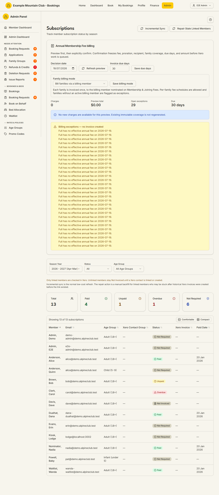

# Subscriptions

Audience: Operator

## What it is

Where you track and drive **annual membership-fee billing** — see each member's
subscription status per season, preview and confirm the annual billing batch,
reconcile paid status from Xero, and mark a member paid manually for cash/cheque
payments. Find it at **Admin → Members → Subscriptions** (`/admin/subscriptions`).

Subscriptions is a **finance** permission area: finance view to read status and
previews, finance **edit** to change settings, confirm billing, retry Xero
delivery, or mark a member paid. All amounts are integer cents; the season year
runs April–March by default (it follows the financial year-end month, which is
configurable — see [Subscription lockout](subscription-lockout.md)).

## When you'd use it

- It is time to invoice the year's annual membership fees.
- You are chasing unpaid or overdue subscriptions, or reconciling paid status from
  Xero.
- A member paid by cash or cheque (no Xero invoice) and you need to mark them paid.
- You are switching the club between family and individual billing.

## Step-by-step

### Review subscription status

1. Go to **Admin → Members → Subscriptions**. Summary cards show Total, Paid,
   Unpaid, Overdue, and Not Required; filter by **Season Year**, **Status**, **Age
   Group**, and **Xero Contact Group**.

   

2. Each row shows the member, age group, Xero contact group, status, Xero invoice
   link, and paid date. Only **linked** members are checked in Xero — unlinked
   members stay *Not Invoiced* until a Xero contact is linked or created.

> **Who shows as *Not Required*.** A member's **membership type** — not their
> login role — decides whether they owe a subscription. A member shows *Not
> Required* only when their season membership type opts out (Life, School,
> Non-Member, and the operational Admin/Lodge accounts), or their age group is
> not subscription-liable. An administrator who is also an ordinary fee-paying
> member (a normal membership type) shows their real Paid / Unpaid status here,
> on their profile, in the members list, and in the CSV export — all of which
> read the same rule. To exempt someone from subscriptions, change their
> membership type; changing only their admin permission does not.
>
> **Assignment changes reconcile the current-season row.** When you assign a
> REQUIRED-type season membership to a member who previously showed *Not Required*
> (for example an operational Admin/Lodge account being made a paying member),
> their current-season subscription row is re-derived on save from *Not Required*
> to *Not Invoiced*, so the members list, member detail, and subscription history
> immediately agree with the booking gate. Rows that carry a real Xero invoice, a
> charge/family coverage, or a manual mark-paid are never changed.
>
> The reconcile runs in the REQUIRED direction only: if you later reassign that
> member back to a Not Required type before any invoice exists, the row keeps
> showing *Not Invoiced* in the raw subscription history until the next Xero
> membership sync re-derives it. All status badges, list filters, exports, and
> the booking gate derive from the membership type and stay correct throughout —
> the stale value is visible only in the history ledger and can never cause a
> charge.
>
> **Before deploying #2149:** because membership type (not login role) now decides
> liability, audit for any operational-role accounts (Admin/Lodge) that hold a
> REQUIRED-type season assignment. The next Xero membership sync will begin
> reflecting their real subscription (Paid/Unpaid/Not Invoiced) state — this is
> intended, but worth a pre-deploy check so no operational account is unexpectedly
> invoiced. Give any such account a NOT_REQUIRED membership type (or remove the
> assignment) if it should stay exempt.

### Refresh paid status from Xero

1. Click **Incremental Sync** for the normal low-cost refresh, or **Repair Stale
   Linked Members** for a broader backfill of linked members that may be stuck.

### Run the annual billing batch

1. In **Annual Membership Fee billing**, set the **Decision date** and click
   **Refresh preview**. Confirm the **Invoice due days** (default 30) and the
   **Family billing mode** if needed.
2. Review the preview total, charges, and any exceptions, then click **Confirm and
   queue annual batch**. Confirmation **freezes** the fee, proration, recipient,
   family coverage, due days, and amount before Xero work is queued — it creates
   durable invoice work and cannot be undone by later fee or family changes.
3. In the **Durable charge queue**, use **Retry** on any charge that failed,
   conflicted, or is still queued.

**Members are never double-billed.** The preview skips any member whose season
subscription is already **paid** *or* already carries a **live Xero invoice**
(status Unpaid, Overdue, or Paid — including invoices raised by the older Xero
sync path that pre-date the durable charge queue). A manually marked-paid member
(cash, no Xero invoice) is skipped too. Skipped members with a live invoice are
listed — with their invoice number — under the collapsed **Already invoiced**
panel below the preview, so you can see exactly who was suppressed and why, and
they are never included in a confirmed batch.

**Families are never double-billed — but a mixed-basis family still bills.** When
a family is invoiced once for a **per-family** fee, the preview suppresses a
second family charge if a family member already holds a live season invoice or an
active per-family coverage claim. That suppression is deliberately narrow: it
applies **only when the member holding the invoice is themselves billed
per-family**. If one member of the family is billed **per-member** (their own
personal subscription invoice) while the rest are billed per-family, that
personal invoice **no longer blocks the family fee** — the family is still billed
once for the per-family members, and the per-member member stays skipped for their
own invoice. A suppressed family is shown, with the covering member and invoice
number, under the collapsed **Already invoiced** panel.

**Only a proven per-member basis lifts suppression.** The family is billed only
when the invoice-holder's own basis resolves to **per-member** — the one case
where their live invoice can be a personal invoice. Any other holder keeps the
family **suppressed** (never silently re-billed): a *no-invoice* fee basis, or a
basis that cannot be resolved at all — their type is *not required* (for example
a Life Member holding the legacy family invoice), no type resolves, or there is
no fee row for their type. Unresolvable cases are tagged **Unresolved basis** in
the **Already invoiced** panel. To re-bill such a family, either fix the holder's membership type/fee so a
real basis resolves, or void the stale invoice in Xero (which releases the block
and re-bills the group as one entry).

**Mark a family as already invoiced (operator override).** Sometimes an older,
ambiguous invoice already covered a whole family, but it sits on a member whose
current billing basis is per-member — so the automatic suppression above will not
recognise it and the family would be billed again. On a per-family charge in the
preview, use **Mark family as already invoiced** (finance edit) to record that
the family is already covered for the season, with an optional note (for example
the covering invoice number). A marked family is suppressed from billing — shown
in the **Already invoiced** panel with an **Operator marked** indicator — until
you **Unmark** it there, which restores it to the next billing run. Marking keeps
an audit row even after you unmark. Use it only when you know a real invoice
covers the family; to re-bill, unmark it. A marker created while a confirm run is
mid-flight can end up alongside a family that was billed by that same run — this
is harmless: the resulting charge's own coverage suppresses the family in every
future preview, so the redundant marker changes nothing. If that invoice is later
voided, the marker simply becomes visible and unmarkable again.

**Voided/deleted invoices re-open billing.** If you **void or delete** a
member's subscription invoice in Xero, the next paid-status refresh clears the
local invoice link, marks the underlying durable charge **Voided** (kept for
audit, never retried), and releases its coverage so the member becomes
**re-billable**. A fresh preview then lists them again, and confirming produces a
**new** charge and invoice. A voided invoice no longer counts as an outstanding
"Unpaid" subscription, so it also stops [locking the member out of
bookings](subscription-lockout.md) — void an invoice only when you intend to
re-bill or clear the obligation.

**Age-tier-exempt members are not billed and raise no exception.** When a
membership type charges *by age tier* and a member's age tier does not require a
paid subscription (for example a Child or Infant tier), that member has no annual
fee by design. The preview lists them — with their age tier — under the collapsed
**Exempt** panel below the preview, and they never raise a "no effective annual
fee" (`MISSING_FEE_SCHEDULE`) exception. Confirming the batch records a
**Not required** subscription for them for the season, so their booking status
stays consistent, but creates no charge and no Xero work. A per-family fee is
unaffected: a family that contains an exempt child is still billed once, so the
child stays in the family's coverage rather than the Exempt panel.

**Refreshing the preview clears stale exceptions.** Exceptions are stored so they
persist between visits. Once you have fixed what caused one (for example added the
missing fee, or linked the Xero account), press **Refresh preview** as a
finance-edit admin: the fresh preview auto-resolves any stored exception it no
longer regenerates — including club-level ones such as a missing Xero account
mapping — and records that the resolution came from the refresh (not a confirm
run). Genuine, still-failing exceptions stay listed in their current wording.
A view-only finance user's Refresh only re-reads the preview and never changes
stored exceptions.

### Mark a member paid manually

1. On a member's row (finance edit), **Mark as paid (manual)** records a payment
   made outside Xero (with an optional note) without creating an invoice. It is
   only offered when the member is unpaid and has no Xero invoice. **Mark as
   unpaid** reverses a manual payment.

## Settings reference

| Control | What it does | Default | Notes / constraints |
| --- | --- | --- | --- |
| Season Year / Status / Age Group / Xero Contact Group | Filter the member list | current season / all | Season year is April–March |
| Incremental Sync | Low-cost Xero paid-status refresh | — | Only checks linked members |
| Repair Stale Linked Members | Broader backfill for stuck linked members | — | Slower; linked members only |
| Decision date | The date the billing preview is computed for | today | NZ date-only |
| Invoice due days | Days until an annual invoice is due | 30 | Integer 1–365 |
| Family billing mode | Bill families via a billing member, or bill members individually | via billing member | Per-family fee schedules require billing-member mode |
| Confirm and queue annual batch | Snapshot the previewed charges and queue Xero work | — | Freezes fee/recipient/amount; cannot be undone by later changes |
| Retry (charge) | Re-attempt a failed/queued charge | — | Idempotent per charge |
| Mark as paid (manual) / unpaid | Record/reverse a non-Xero payment | — | Only when unpaid with no Xero invoice; never calls Xero |
| Mark family as already invoiced / Unmark | Suppress/restore a per-family charge you know is already covered | — | Finance edit; idempotent; keeps an audit row on unmark |

## Troubleshooting

| Symptom | Likely cause | Fix |
| --- | --- | --- |
| The billing panel and Actions column are read-only | Your finance role is view-only | Ask a finance-edit admin |
| A member stays "Not Invoiced" | They have no Xero contact link | Link or create a Xero contact in [Members](members.md), then run a refresh |
| A sync fails | Xero is disconnected or errored | Check the Xero connection in the [Xero Sync guide](xero.md) |
| **Mark as paid (manual)** isn't offered | The row already has a Xero invoice, is already paid, or is not required | Record the payment against the invoice in Xero instead |
| A member is missing from the preview | They are already paid, or already hold a live Xero invoice for the season | Check the collapsed **Already invoiced** panel; record payment against the existing invoice in Xero, or void it there to re-bill |
| A voided-invoice member still won't re-bill | The paid-status refresh has not run since you voided the invoice in Xero | Run **Incremental Sync** (or the daily refresh), then refresh the preview — the member reappears with a new charge |
| A per-family fee raised an exception | The club bills individually but the schedule is per-family | Re-base the schedule to per-member/no-invoice in [Fees](fees.md), or switch the family billing mode here |
| A mixed-basis family is billed again after a member's personal invoice | The personal invoice is a **per-member** charge, so it does not cover the family fee | Expected; if a real invoice already covered the whole family, use **Mark family as already invoiced** on that preview entry |
| A family you marked still shows in the preview | The marker was released, or you marked a different season | Check the **Already invoiced** panel for the **Operator marked** indicator; re-mark for the correct season if needed |
| A child/infant member is missing from the preview | Their age tier does not require a subscription | Expected — check the collapsed **Exempt** panel; confirming records a Not-required season row, no invoice |
| A `MISSING_FEE_SCHEDULE` (or other) exception won't clear after you fixed it | The stored exception only clears on an edit-gated preview refresh | As a finance-edit admin, press **Refresh preview**; the fresh preview auto-resolves any exception it no longer regenerates |

## Related links

- Back to the [documentation hub](../README.md).
- Feature hub: [Finance dashboard](../finance-dashboard/README.md), and the
  [Xero subsystem](../xero/ARCHITECTURE.md).
- Sibling guides: [Fees](fees.md), [Members](members.md),
  [Subscription Lockout](subscription-lockout.md), [Xero Sync](xero.md),
  [Family Groups](family-groups.md).
- Reference: the
  [membership subscription charge lifecycle](../STATE_MACHINES.md#membership-subscription-charge-lifecycle)
  and
  [member subscription status transitions](../STATE_MACHINES.md#member-subscription-status-transitions),
  the [membership subscription billing](../../CONFIGURATION.md#membership-subscription-billing)
  and [manual mark-paid](../../CONFIGURATION.md#manual-mark-paid-clubs-that-do-not-use-xero-or-cash-payments)
  references, and the
  [subscription invoice workflow](../AUTHORITATIVE_FEES.md#subscription-invoice-workflow)
  in `AUTHORITATIVE_FEES.md`.
