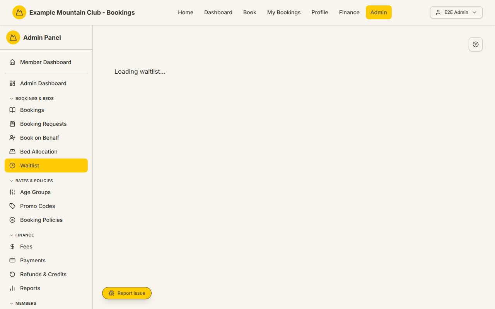

# Waitlist

Audience: Operator

## What it is

A paginated queue of waitlisted bookings — members waiting for a bed on nights
that were full — where an admin can **force-confirm** an entry, with dialogs
that handle overbooking and whether to email the member. Find it at **Admin →
Bookings & Beds → Waitlist** (`/admin/waitlist`).

The waitlist is gated by the **`waitlist`** module, which also gates the
force-confirm action. Force-confirm itself sits in the **bookings** permission
area, so a view-only bookings role can browse the queue but not act on it. Money
is integer cents (shown as dollars); dates are NZ date-only lodge nights.

## When you'd use it

- A night frees up and you want to confirm the next waitlisted member.
- A member accepts a waitlist offer and you need to push their booking through.
- You want to see who is waiting, in what order, and whether their offer email
  was sent.

## Step-by-step

### Open and read the queue

1. Go to **Admin → Bookings & Beds → Waitlist**. The header shows the total
   count. Each row shows the position, member, stay, guests, price, status, the
   source/offer context, when it was created, and a **Force Confirm** action.

   

2. The **Source** column explains each entry — for example "Position #2 waiting
   for capacity" or "Offer expires {date}" — and flags an offer email that is
   missing or undeliverable, with a link to review email deliverability.

### Filter the queue

1. Use **From**, **To**, and **Page size**, then click **Apply**. Click
   **Clear** to reset. The filters are stored in the page URL.

### Force-confirm a booking

1. Click **Force Confirm** on the entry.
2. If confirming would email the member (the booking lands paid), the **Email
   the member about this confirmation?** dialog appears — choose **Confirm and
   email member** or **Confirm without emailing**. Your choice is recorded in
   the audit log.
3. If the booking would exceed capacity, the overbook dialog lists the affected
   dates. Click **Confirm Anyway (Overbook)** to proceed — this writes a
   critical audit record you can open from the confirmation.

## Settings reference

The waitlist is a work queue, not a settings page. Its controls:

| Control | What it does | Default | Notes / constraints |
| --- | --- | --- | --- |
| From / To | Filter by stay date | empty | NZ date-only |
| Page size | Rows per page | 25 | 10 / 25 / 50 / 100 |
| Apply / Clear | Apply or reset the filters | — | Stored in the URL |
| Force Confirm | Confirm a waitlisted booking | — | Needs bookings edit access; may prompt for email choice and/or overbook confirmation |

Status chips include **Waitlisted** and **Waitlist Offered**; a warning line
appears when the booking still needs admin review. Offer-email badges show
whether the offer email was sent, queued, retrying, or undeliverable.

## Troubleshooting

| Symptom | Likely cause | Fix |
| --- | --- | --- |
| Waitlist is missing from the sidebar | The `waitlist` module is off | Enable it under **Admin → Setup → Modules** — see [`CONFIGURATION.md`](../../CONFIGURATION.md#module-controls-and-admin-modules) |
| **Force Confirm** is disabled | Your admin role is view-only for bookings | Ask a full admin for bookings edit access |
| "Offer email log missing" / "undeliverable" badge | The waitlist offer email did not send | Click **Review email recovery** to open the email deliverability page (`/admin/email-deliverability`) and re-send |
| Confirming warns about overbooking | The lodge is full for those nights | Use **Confirm Anyway (Overbook)** only when you intend to overbook; it is audited |
| "Unpaid finished stay created" after confirming | The confirmed stay is in the past and unpaid | Chase it from the **Unpaid Finished Stays** queue on the [Bookings](bookings.md) list |

## Related links

- Back to the [documentation hub](../README.md).
- Sibling guides: [Bookings](bookings.md), [Bed Allocation](bed-allocation.md),
  [Booking Requests](booking-requests.md).
- Reference: the
  [waitlist lifecycle](../STATE_MACHINES.md#waitlist-lifecycle), the waitlist
  cron in [`CONFIGURATION.md`](../../CONFIGURATION.md#cron-waitlist-and-backups),
  and [capacity and overbooking](../CAPACITY_MODEL.md#exceeding-the-ceiling-admin-overbook-overrides).
