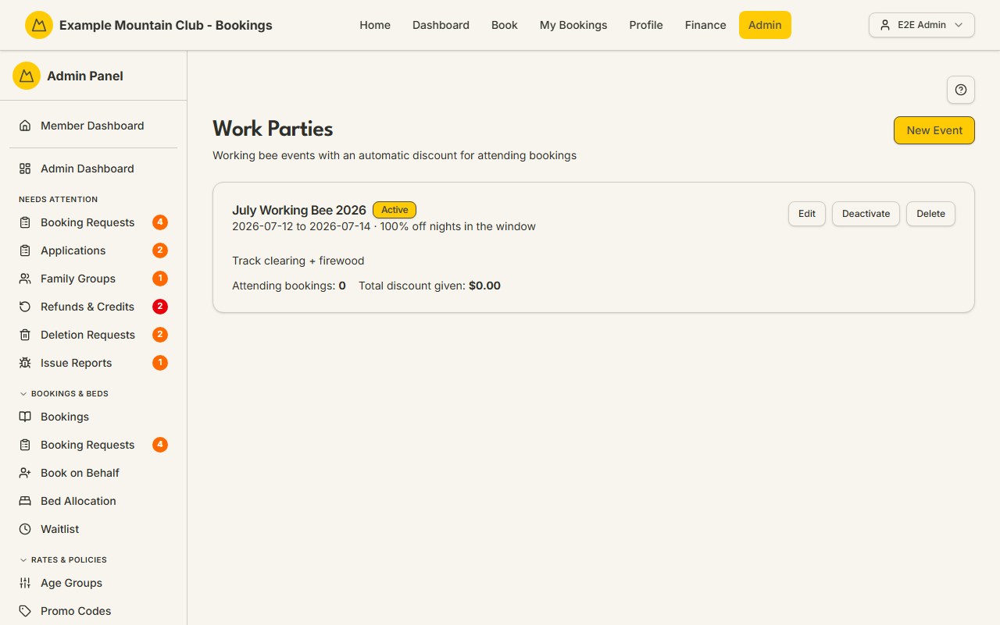

# Work Parties

Audience: Operator

## What it is

Working-bee events with an automatic booking discount: you set a date window and a
discount percentage, and members who tick "I am attending a working bee" when they
book nights inside that window get the discount applied automatically. Find it at
**Admin → Lodge Operations → Work Parties** (`/admin/work-parties`).

Work-party events are a **lodge** permission area: lodge view to read, lodge
**edit** to create, edit, or delete. The feature is on by default (the
`workParties` module).

## When you'd use it

- You are running a spring or autumn working bee and want to reward attendees with
  discounted nights.
- You want to see how many bookings claimed a working-bee discount and the total
  given.
- A working bee's dates or discount changed and you need to update it.

## Step-by-step

### Review the working-bee events

1. Go to **Admin → Lodge Operations → Work Parties**. Each event card shows its
   date window, discount, active state, the number of attending bookings, and the
   total discount given so far.

   

2. On an event with attending bookings, click **Show bookings** to expand the
   member, stay, status, and per-booking discount.

### Create or edit an event

1. Click **New Event** (or **Edit** on a card).
2. Set the **Name**, **Discount %** (a whole number 1–100), the **Start date** and
   **End date (last discounted night)**, an optional **Description**, and, with
   more than one lodge, the **Lodge** (or all lodges, club-wide). Tick **Active** so
   members can select it when booking.
3. Click **Create Event** / **Save Changes**. The discount applies to every
   attending guest's nights inside the window.

### Deactivate or delete

1. Use **Deactivate**/**Activate** to control whether members can select the event.
2. **Delete** is available only while an event has **no** attending bookings; once
   bookings have claimed it, deactivate it instead to preserve the discount history.

## Settings reference

| Field | What it controls | Default | Notes / constraints |
| --- | --- | --- | --- |
| Name | The event's display name | — | Required |
| Discount % | Percent off nights in the window | 100 | Whole number 1–100 |
| Start date | First night in the discount window | — | NZ date-only |
| End date (last discounted night) | Last night in the discount window | — | NZ date-only; inclusive |
| Description | A note shown on the card | — | Optional; up to 1000 characters |
| Lodge | Which lodge the working bee is at | All lodges (club-wide) | Only shown with more than one active lodge |
| Active | Whether members can select the event when booking | on | Inactive events cannot be selected |

> Discounts are computed and stored in **integer cents**; the totals shown (e.g.
> "Total discount given") are those cents formatted as currency.

## Troubleshooting

| Symptom | Likely cause | Fix |
| --- | --- | --- |
| Work Parties is missing from the sidebar / 404s | The `workParties` module is off | Enable it under **Admin → Setup → Modules** — see [`CONFIGURATION.md`](../../CONFIGURATION.md#module-controls-and-admin-modules) |
| Everything is read-only ("… can view work parties but cannot change them") | Your admin role has lodge view but not edit | Ask a full admin for **lodge edit** access |
| There's no Delete button on an event | It already has attending bookings | Deactivate it instead — delete is blocked to keep the discount history |
| A member says the discount didn't apply | The event is inactive, their nights fall outside the window, or they didn't tick the working-bee option | Check the event is Active, its dates cover their nights, and that they selected it when booking |
| "Discount must be a whole number between 1 and 100" | A non-integer or out-of-range discount was entered | Enter a whole number from 1 to 100 |

## Related links

- Back to the [documentation hub](../README.md).
- Sibling guides: [Chore Roster](roster.md), [Hut Leaders](hut-leaders.md),
  [Lodges](lodges.md), [Bookings](bookings.md).
- Reference: [Admin and Lodge](../ARCHITECTURE.md#admin-and-lodge).
