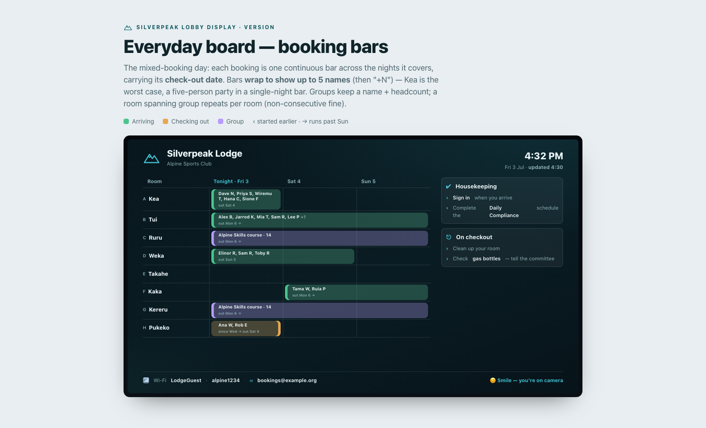
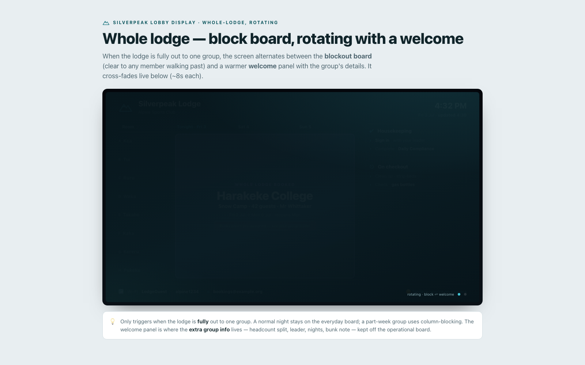
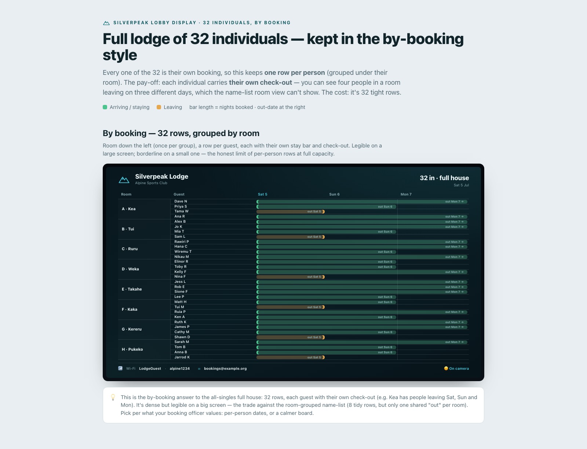
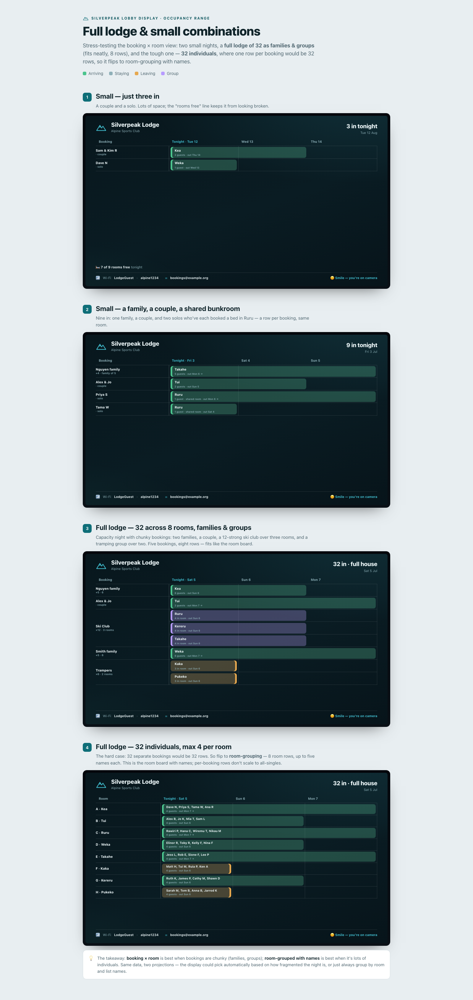

# Lobby TV Display

> Part of the [documentation hub](../README.md).

**A live, self-updating lodge noticeboard — the whiteboard that keeps itself current.**

Pair a TV's browser with the booking system and it shows guests and hut leaders
what's happening in the lodge: who's arriving, departing and staying over the
coming days, who's in which room, today's chores, and arrival information like
wifi details and check-in reminders. Everything on screen is driven by data the
system already holds — nothing to manually update, safe to hang on a public
wall and forget.

> **Status:** built and integrated on the `feature/lobby-display-v2` branch,
> awaiting the end-to-end owner review before the single upstream PR. The
> authoring model was rebuilt to the Layout / Template / Module design
> ([ADR-003](decisions/ADR-003-layout-template-authoring-model.md)); the v2
> rebuild spans the schema, render pipeline, admin hub, previews, seeds, and
> config-transfer — far more than the original MVP task list.
> Delivery is tracked in [epic hoppers99#25](https://github.com/hoppers99/AlpineClubBookingsNZ/issues/25);
> the feature was proposed and discussed in
> [upstream discussion #964](https://github.com/thatskiff33/AlpineClubBookingsNZ/discussions/964#discussioncomment-17602129).

## Why

Most club lodges run a lobby whiteboard: room assignments, arrivals, reminders —
hand-written, and stale the moment bookings change. The kiosk (an interactive
tablet) covers check-in and chores for the person standing at it; the lobby TV
is its complement — a **dynamic but non-interactive** display the whole room can
read at a glance, always matching the booking system.

## What it does

- **Entirely data-driven, zero upkeep** — bookings, room assignments, chore
  rosters, and lodge content come straight from live system data. No second
  content system to maintain: once paired and configured, the screen stays
  correct as bookings change.
- **Simple device pairing** — point any TV browser (or a Raspberry Pi) at the
  site, confirm a short code from a logged-in device; displays are per-lodge,
  read-only, individually revocable, and survive reboots without anyone typing
  credentials on a remote.
- **Live occupancy views** — arrivals/departures/stays for the next few days:
  room-grouped when bed allocation is on, by-booking when it's off, and a
  whole-lodge view for full-lodge/group bookings.
- **Chores on screen** — the day's chore list and assignments from the existing
  roster data.
- **Lodge rules & arrival info** — club-authored content plus per-lodge values
  (e.g. `{{config:wifi-code}}`) editable without a deploy.
- **Committee notice board** — a free-text notice, edited by permitted admins,
  for reminders that don't live in booking data.
- **Templates, not hardcoding** — pick from provided layouts, configure what
  each screen area shows; panels rotate only when they make sense (e.g. the
  whole-lodge view appears only while the lodge actually has a full-lodge
  booking).
- **Visual builder (no HTML)** — compose a board by picking a shape and dropping
  modules into zones, with a live sandboxed preview, then save (`ADR-004`). It
  writes a valid layout + template for you; the raw-HTML editors remain as
  **Advanced mode**. Drag-and-drop is fully keyboard-operable with menu/button
  fallbacks, and the option controls only ever offer privacy-safe values.
- **Admin preview** — administrators can open any device's board or any
  template full-screen in their own browser (read-only, same privacy rules,
  no effect on the device's "last seen") before it ever reaches a lobby wall.
- **Privacy-aware by design** — configurable name granularity (full name /
  first name + initial / first name / counts only), enforced at the data
  layer so no template can display more than the API serves; bookings that
  include children always collapse to a family label, and organisations
  (schools) show their group name only.
- **Optional module** — feature-flagged off by default; clubs that don't enable
  it see nothing.
- **Later** — skifield weather/conditions panel reusing the existing conditions
  widget.

## Design gallery

Selected concepts from the design exploration (mock data throughout — every
name, booking, and contact detail is fictional). The full interactive catalogue
is in [`mockups/`](mockups/) — open [`mockups/index.html`](mockups/index.html)
locally (download the folder, or serve it with any static file server) to
browse all variants and iterations.

### Everyday board — booking bars

The bread-and-butter view: each booking is one continuous bar across the nights
it covers, carrying its check-out date; bars wrap to show up to five names, then
"+N".

### Whole-lodge bookings — blockout

When a group books the entire lodge (no room assignment), the board shows the
group label only — with a rotating variant that alternates blockout and welcome
panels.

### Full house of singles — by booking

When allocation is per-person, rows group by booking and room, each guest
keeping their own check-out date.

## Template gallery

The pre-built boards a lodge can assign straight away (issue #2047). Every board
also carries the fixed lodge header and the info footer; the module lists below
are the content each board adds. The same gallery is surfaced in-app on
**Admin → Display → Reference** (with monogram placeholders — open a live
**Preview** from the Templates page to see the real board), and the built-ins
appear ready to assign on **Admin → Display → Templates**.

**Delivery split.** The four broadly-useful boards ship as **built-in seeds**
(seeded into every install and refreshed from code on re-seed, like the three
originals). The two situational boards ship in the importable **extras bundle**
[`seeds/display-template-pack.bundle.zip`](seeds/README.md) — keeping the
built-in set focused on the everyday boards while still shipping the niche ones
for the installs that want them. Between them the pack also completes built-in
coverage of the module catalogue: they are the first built-in use of
`room-cards`, `night-columns`, and `status-board`.

### Built-in boards

| Board | Modules | What it shows |
|---|---|---|
| **Everyday board** | arrivals-board · chores-board · lodge-rules · notice-board | The daily arrivals bar board with a stacked side rail (chores, house rules, and a committee notice when one is set). |
| **Whole lodge** | occupancy-grid · welcome · notice-board | A rotating statement: the whole-lodge blockout when the lodge is booked out, a welcome panel, and a committee notice when one is set. |
| **Singles house** | singles-board · notice-board | The by-booking singles board, rotating with a committee notice when one is set. |
| **Room by room** | room-cards · arrivals-board | Tonight's rooms as cards (who sleeps where) with a live arrivals side rail. Room cards need bed allocation. |
| **Nights ahead** | night-columns · notice-board | The next three nights at a glance — room-level night columns (rooms shown when bed allocation is on) over a committee-notice band that appears only when a notice is set. |
| **Lodge operations** | status-board · chores-board · notice-board | The roomless tonight status board (arriving / staying / leaving) with a chores and notice rail; the chores card hides itself when the Chores module is off, so the rail keeps its shape. |
| **Welcome kiosk** | welcome · lodge-rules · notice-board | Maximum-privacy greeter: a welcome hero over a rotator cycling the house rules and (when set) the committee notice. **Shows no guest roster or arrivals names** — only the whole-lodge group label, reduced to the lodge's privacy setting; safe for the most public spot in the lodge. |

### Extras bundle boards

Import [`seeds/display-template-pack.bundle.zip`](seeds/README.md) to add these.

| Board | Modules | What it shows |
|---|---|---|
| **Busy weekend (rotating)** | occupancy-grid · arrivals-board · notice-board | One rotating statement for a packed weekend: the whole-lodge blockout when booked out, a tight two-night arrivals board, and a committee notice when one is set. |
| **Minimal arrivals strip** | arrivals-board · welcome | A compact board for a small secondary screen: tonight's arrivals as a single-night strip (lead name + count) above a welcome panel. |

## Design documents

| Document | What it covers |
|---|---|
| [`brief.md`](brief.md) | The feature brief: goals, non-goals, settled decisions, open questions, success criteria |
| [`design.md`](design.md) | Technical design: data model, pairing/auth, display-state API, Layout/Template/Module model (with diagrams + a worked example), testing strategy |
| [`operating.md`](operating.md) | Runbook to set up a screen (pair, assign a template, per-lodge config) and a developer guide to extending (add a module / condition) |
| [`phone-visibility.md`](phone-visibility.md) | Member phone-number opt-in (#37): the two-sided consent gate, the staff-kiosk exemption, and where each control lives |
| [`config-transfer-workflow.md`](config-transfer-workflow.md) | Moving display config between environments as bundles |
| `decisions/` | ADRs (pairing/auth model; template model + storage; Layout/Template authoring; **the guided visual builder — ADR-004**) — authored with their keystone tasks |
| [`mockups/`](mockups/) | The full design-exploration catalogue, organised by concept |

## Delivery

Built and validated end-to-end on this fork: child tasks (see the
[epic](https://github.com/hoppers99/AlpineClubBookingsNZ/issues/25)) branch from
and merge into `feature/lobby-display-v2`, each passing the full validation gate.
When the feature is complete and proven, it is proposed upstream as a single
PR. Feedback is welcome at any stage — the epic and the
[upstream discussion](https://github.com/thatskiff33/AlpineClubBookingsNZ/discussions/964#discussioncomment-17602129)
are the places for it.
