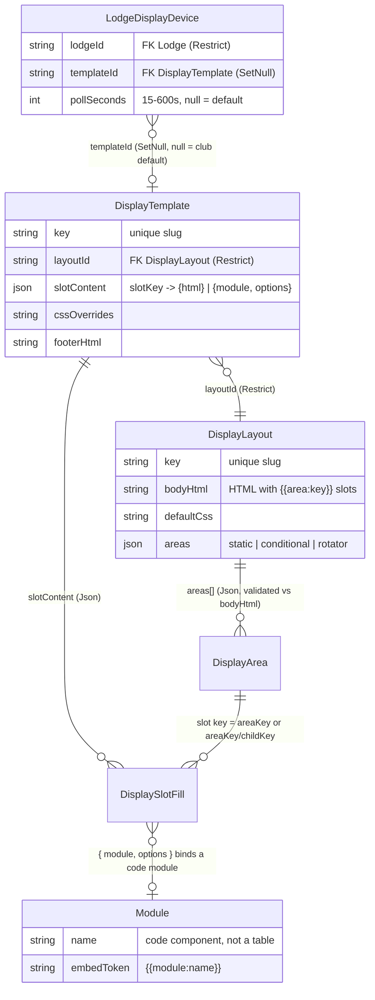
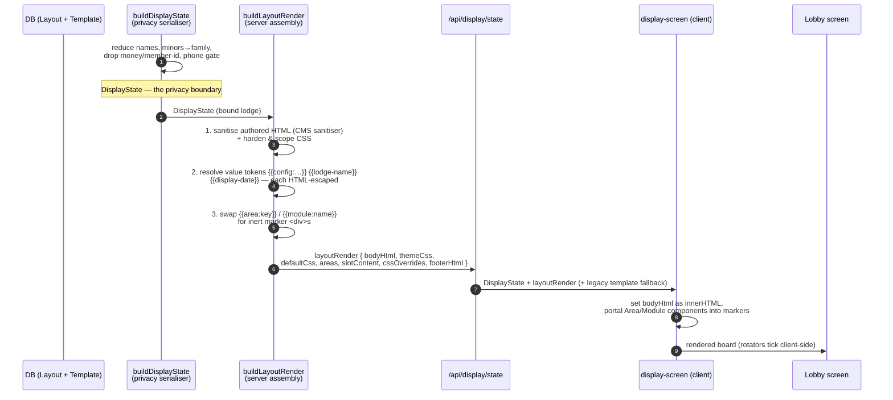

# Lobby TV Display — Design Specification

**Status:** Implemented on the `feature/lobby-display-v2` integration branch.
The authoring model was rebuilt to the **Layout / Template / Module** design in
[ADR-003](decisions/ADR-003-layout-template-authoring-model.md); this document
describes that current model, not the superseded MVP. Not yet proposed upstream
as code; heads-up posted in
[upstream discussion #964](https://github.com/thatskiff33/AlpineClubBookingsNZ/discussions/964#discussioncomment-17602129).

This document expands the [feature brief](brief.md) into a technical design —
see [`README.md`](README.md) for the feature overview and design gallery,
[`operating.md`](operating.md) for the set-up runbook and the developer
"extending" guide, and [`mockups/`](mockups/) for the design-exploration
catalogue. Structural decisions with real trade-offs get ADRs in
`docs/lobby-display/decisions/`, authored with the keystone tasks that implement
them.

> **Reading the provenance notes.** Internal tracker ids (`LTV-0xx`, `#nn`) are
> collected in the [History and provenance](#13-history-and-provenance) appendix
> rather than woven through the body. The section prose below describes the
> current, shipped behaviour; reach for the appendix and the ADRs only when you
> need the "why" or the change history.

---

## 1. Overview and principles

A read-only, per-lodge lobby display: a paired TV/device renders an
admin-chosen template of lodge activity and arrival information, driven by
live booking data, safe to show in a public physical space.

Principles, in priority order:

1. **Entirely data-driven.** Everything on screen derives from data the
   system already holds (bookings, room assignments, chore rosters, lodge
   instructions, per-lodge config). No display-specific content to keep
   current beyond template choice and config values. The display introduces
   no second source of truth.
2. **Privacy enforced at the data layer.** The display-state API serialises
   names already reduced to the configured granularity. No template, module,
   or custom markup can display more than the API serves.
3. **Weakest-privilege auth surface.** A display token reaches only the
   display page and display-state API for its bound lodge — never kiosk,
   member, or admin routes. Read-only by construction.
4. **Lodge-scoped from day one.** All data resolution reuses the kiosk
   lodge-scoping machinery (`resolveKioskLodgeId` patterns, ambiguous
   bindings deny per the M5 precedent).
5. **Off by default.** Gated by a `ClubModuleSettings.lobbyDisplay` flag;
   clubs that do not enable it see no routes, UI, or tokens.

## 2. Displayable content (v1 targets)

Per lodge:

- **Bookings and room assignments** in all three occupancy modes:
  - bed allocation enabled → room-grouped views;
  - allocation disabled → by-booking views;
  - whole-lodge/group bookings → blockout view (booking/group name only).
- **Chore list / assignments** — the day's roster from existing chore data.
- **Lodge rules and arrival information** — club-authored content (lodge
  instructions), plus lodge-specific values via config tokens (wifi code,
  check-in reminders).
- **Skifield conditions** — later addition: reuse the existing
  `{{skifield-conditions}}` embed once widget data is configured for the
  relevant skifield. Not a v1 blocker.

## 3. Data model

The authoring model is three database entities plus a small set of per-lodge
`Lodge` columns. `prisma/schema.prisma` is the source of truth; the shapes below
are the real columns (elided: `createdAt`/`updatedAt` timestamps and back
relations).

- **`DisplayLayout`** — the structural template. `key` (unique slug), `name`,
  `description?`, `bodyHtml` (the HTML skeleton carrying `{{area:key}}` slots),
  `defaultCss`, and `areas` (Json — the ordered area/slot descriptors validated
  against `bodyHtml`).
- **`DisplayTemplate`** — a selectable design built on one Layout. `key`
  (unique slug), `name`, `layoutId` (FK → `DisplayLayout`, `onDelete: Restrict`
  — a Layout still used by a Template cannot be deleted), `slotContent` (Json —
  maps each slot key to `{ html }` or `{ module, options? }`), `cssOverrides`,
  and `footerHtml`.
- **`LodgeDisplayDevice`** — one physical screen paired to exactly one lodge.
  `lodgeId` (FK → `Lodge`, `Restrict`), `name`, the pairing lifecycle fields
  (`pairingCode`, `pairingCodeExpiresAt`, `tokenHash` — the display credential
  is stored **hashed**, per `docs/TOKEN_HASHING.md`), `templateId` (FK →
  `DisplayTemplate`, `onDelete: SetNull` — deleting a bound Template drops the
  device to the club default rather than breaking it; `null` = club default),
  `pollSeconds?` (per-device refresh cadence, clamped 15–600s server-side),
  `lastSeenAt`, and `revokedAt`. Indexed on `lodgeId` and `templateId`.

Per-lodge columns on `Lodge` (unchanged across the rebuild):

| Column | Purpose |
|---|---|
| `displayConfig` (Json) | The `{{config:<key>}}` value glob — e.g. `{"wifi-code": "…"}`. Sanitised to a flat string map by the serialiser. |
| `displayNameGranularity` (`DisplayNameGranularity?`) | Per-lodge name-granularity override (null = club default; §10). |
| `displayNotice` (`String?`, ≤2000) | The committee notice free text (§10). |
| `showGuestPhonesOnScreens` (Boolean, default `false`) | Lodge side of the two-sided phone-visibility gate ([`phone-visibility.md`](phone-visibility.md)). |

Config keys the built-in **furniture** reads (any other key is available to a
Template through `{{config:<key>}}`):

| Key | Consumed by |
|---|---|
| `wifi-name` / `wifi-code` | the info-footer Wi-Fi item |
| `contact-email` | the info-footer email item |
| `footer-note` | the info-footer accent note (token-resolved) |

The whole surface is **additive** to the schema; run `npm run db:check-drift`
against a shadow DB after any change to these models.

**The three built-in designs are ordinary seeded rows, not a code registry.**
`ensureBuiltInDisplays(prisma)` (`src/lib/lodge-display/built-in-seeds.ts`,
wired into `prisma/seed.ts`) upserts the `everyday-board`, `whole-lodge`, and
`singles-house` Layout+Template pairs by `key`, create-if-missing, and
**refreshes their definitions from code on every re-seed** — they are
code-managed scaffolding, so shipped-design improvements reach already-seeded
installs. An admin customises by **duplicating** a built-in into a new
(non-`builtin-`) row; editing a built-in in place is overwritten on the next
re-seed. Devices bind to these rows by `templateId` like any other Template. The
club-wide Layout/Template library is also portable between environments as a
bundle — see [`config-transfer-workflow.md`](config-transfer-workflow.md).

> **MVP (superseded).** The first MVP shipped a single data-only
> `DisplayTemplate` model (a `definition` JSON of regions → panels, a
> `DisplayTemplateSource` enum) plus a `LodgeDisplayDevice.regionConfig` column
> and an interim `templateKey` device column. [ADR-003](decisions/ADR-003-layout-template-authoring-model.md)
> replaced that authoring layer; because nothing had shipped to production, the
> branch migrations were consolidated into one clean
> `20260712130000_add_lobby_display` migration and the interim columns removed.
> The old region/panel *code* registry (`template-registry.ts`) survives only as
> the zero-DB engine the unattended-safety fallback board leans on (§9). See the
> [History appendix](#13-history-and-provenance).

## 4. Device pairing and display auth

New auth surface, deliberately weaker than every existing tier. Decided in
[ADR-001](decisions/ADR-001-device-pairing-auth-model.md) (threat model,
token lifetime, cookie vs header, rate limiting) and implemented in issue
#27.

> **Route namespace (ADR-001 §1):** display routes live at `/display` and
> `/api/display/*` (admin management under `/api/admin/display/*`) — NOT
> under `/lodge` as first sketched, because the kiosk flag gates the whole
> `/lodge` prefix space and the display module must work without the kiosk.

Pairing flow (stateless start / admin bind / device claim — ADR-001 §2):

1. Admin creates a device record (name + lodge) in the admin UI.
2. TV browser visits `/display` unauthenticated → the page requests a
   pairing code from the public pairing endpoint, which returns the code
   inside an HMAC-signed httpOnly cookie blob and persists nothing.
3. Admin enters/confirms the code against the device record in the admin UI
   (this persists the code + 15-minute expiry onto the device row).
4. The TV's claim poll matches its signed blob to the bound code and
   receives a long-lived display token (httpOnly cookie), stored hashed on
   the device record; the pairing fields clear (single-use). The page
   reloads into display mode.

Auth behaviour:

- The display token authenticates **only**: the display page shell, the
  display-state API, and a lightweight heartbeat (updates `lastSeenAt`).
  Everything else treats it as anonymous. In practice the state poll
  doubles as the heartbeat (LTV-013): every successful device-token fetch
  stamps `lastSeenAt`, so admins see a live "last seen" without a separate
  call; admin previews never stamp it.
- Tokens are revocable per device from the admin UI; a revoked device stops
  rendering lodge data within one refresh interval and returns to the
  pairing screen.
- Survives reboots/network blips (cookie persistence); re-pairing needed
  only on revocation or expiry.
- Ambiguous lodge binding is impossible by construction (deviceId → lodgeId
  is a direct FK), but lodge resolution still validates the lodge is active.
- The whole surface is gated by the `lobbyDisplay` module flag in the proxy
  layer (as kiosk routes are today): flag off → 404.

## 5. Display-state API (the data contract)

`GET /api/display/state` (display-token auth; window parameters
validated server-side against configured bounds).

> **Preview callers (LTV-013/017/036).** Besides a paired device (cookie), the
> route serves three admin previews, all read-only (never stamp `lastSeenAt`):
> `?previewDevice=<id>` (the device's lodge + template), `?preview=1&templateId=<id>[&previewLodge=<id>]`
> (an authored v2 template against an **explicit** lodge — validated active,
> club default when omitted; the old silent default is gone, #64), and
> `?preview=1` (the club-default fallback board, default lodge; the legacy
> `&templateKey=…` param was removed in #86 / LTV-040). These honour a
> full-admin session. A fourth caller, `?previewGrant=<token>`, is a signed
> preview grant (LTV-036, ADR-003 §5): it authorises one template/lodge preview
> **without** a session so the authoring page can embed it in a sandboxed
> (opaque-origin) iframe; its cross-origin response carries a permissive CORS
> header (no credentials sent). All previews may add `?previewDate=YYYY-MM-DD`
> to simulate the window start (device fetches ignore it) — except that when a
> signed grant already carries a `windowStart`, that signed value is
> authoritative and a conflicting `?previewDate` on the sandbox-rewritable iframe
> URL cannot shift the served window beyond it (issue #176); the in-frame date
> picker still drives the window when the grant carries no signed date. Every
> payload response also sets `Cache-Control: no-store` so the privacy-reduced
> feed — which can include guest names and opted-in phone numbers — is never held
> in a shared or browser cache.

One JSON payload per request covering the display window — every module is a
pure function of this payload. The contract below is copied verbatim from
`src/lib/lodge-display-state.ts`, **the single privacy-enforcement point**:
names leave here already reduced to the configured granularity, minors are never
individually named, and no monetary or member-id field is ever selected. No
template, module, or authored markup can reach past it.

```ts
interface DisplayStateGuest {
  label: string;              // privacy-reduced name (per granularity)
  stayStart: string;          // NZ date-only
  stayEnd: string;            // NZ date-only (check-out)
  /** Adult member phone — present ONLY under the two-sided consent gate
   *  (phone-visibility.md); omitted otherwise. */
  phone?: string;
}

interface DisplayStateBooking {
  key: string;                // opaque per-row key — never the real booking id
  label: string;              // privacy-reduced booking/group label
  wholeLodge: boolean;
  roomId: string | null;      // null when bed allocation is off
  /** null when names are withheld (counts-only, family, org, whole-lodge). */
  guests: DisplayStateGuest[] | null;
  guestCount: number;
  stayStart: string;          // earliest guest stay-start on the row
  stayEnd: string;            // latest guest stay-end on the row
}

interface DisplayState {
  lodge: { name: string };
  /** Header brand block: club name + club-theme logo (presentation-only,
   *  already public on every website page). */
  club: { name: string; logoDataUrl: string | null };
  generatedAt: string;        // ISO instant, for stale detection
  window: { start: string; days: number };            // NZ date-only start + clamped length
  rooms: Array<{ id: string; name: string }> | null;  // null = bed allocation off
  bookings: DisplayStateBooking[];                     // rows split per (booking, room)
  occupancy: Array<{ date: string; arriving: number; departing: number; staying: number }>;
  chores: Array<{ date: string; title: string; assigneeLabels: string[] }>;
  rules: Array<{ title: string; html: string }> | null;  // sanitised lodge-instruction docs
  /** Committee notice free text; rendered as text nodes only, {{config:…}}
   *  placeholders resolve at render. */
  notice: string | null;
  config: Record<string, string>;         // per-lodge {{config:key}} glob, sanitised
  /** Display-relevant module flags only (bed-allocation, chores) — the
   *  capability conditions read these; the full club flag map never ships. */
  capabilities: Record<string, boolean>;
}
```

- **Privacy reduction happens here** (labels, counts-only mode, group
  labelling, minors-as-family, the phone gate) — the serialiser is the single
  enforcement point and the primary unit-test surface for privacy rules. Booking
  rows are split per (booking, room) and carry an opaque `key`, never the real
  booking id.
- Data sourcing reuses the kiosk queries (`LODGE_VISIBLE_BOOKING_STATUSES`,
  stay-range helpers, `lodgeNullTolerantScope`) — no parallel query logic.
- Client polls on an interval; the page shows a stale indicator when the
  render ages past a threshold and keeps the last good render on transient
  failures.
- **Per-device poll cadence** (LTV-039, issue #85; consolidates #66):
  `LodgeDisplayDevice.pollSeconds` (nullable) sets a device's refresh cadence.
  The response body carries the effective `pollSeconds` — a device fetch serves
  its configured value, a preview always serves the default — clamped
  server-side to **15–600s** (null → the ~60s default) so an out-of-range value
  can never make a wall hammer or starve the API. The client drives its
  active-board tick from that value (falling back to the default before the
  first payload) and scales the staleness threshold to **3× the effective
  interval**. Admins set it per device on `/admin/display/devices` ("Refresh
  every", blank = default). Because the poll doubles as the heartbeat, the cadence also
  governs how often the device's **"last seen"** refreshes — a slow cadence
  means a slower-updating last-seen. Writes clamp/validate to the same 15–600
  range (out-of-range → 400) and are audit-logged.

## 6. Layout / Template / Module model

The authoring model has three parts, decided in
[ADR-003](decisions/ADR-003-layout-template-authoring-model.md) §1 and
implemented across `src/lib/lodge-display/`. It is closer to the website CMS
than to a JSON definition: admins compose a display from an HTML **Layout**,
fill its named areas with content or embedded **Modules**, and style it with
CSS.

- **Layout** (`DisplayLayout`, admin-authored) — the structure. Its `bodyHtml`
  is an HTML skeleton that names **areas/slots** with `{{area:<key>}}`
  placeholders; a companion `areas` descriptor list (validated to agree exactly
  with the placeholders, both directions) declares each area's `kind`:
  - *static* — always rendered;
  - *conditional* — rendered only while its assigned condition holds;
  - *rotator* — cycles among its child slots on a `rotateSeconds` timer, each
    child optionally condition-gated, so it rotates only among currently-eligible
    children.

  A Layout also carries a `defaultCss` block and, per static/conditional area,
  an optional `defaultContent` fallback. All Layouts share a **fixed header**
  (logo, lodge name, club name, live clock) and an **editable footer** — only
  the body differs.
- **Template** (`DisplayTemplate`, admin-authored, the selectable design) —
  built on exactly one Layout (locked after creation). Its `slotContent` maps
  each declared slot key to either authored `{ html }` or an embedded
  `{ module, options? }`; a static/conditional area's slot key is its area key,
  a rotator child's is `"<areaKey>/<childKey>"`. A Template adds `cssOverrides`
  (layered after the Layout default) and `footerHtml`. It renders **dynamically
  against whichever lodge its display is bound to** — lodge-specific values come
  from `{{config:…}}` tokens, so one Template serves every lodge.
- **Module** (developer code — like the website's weather widget) — a React
  component in `src/components/lodge-display/modules/`, referenced from a
  Layout/Template by a `{{module:<name>}}` embed token or a `{ module }` slot
  fill. Admins **style** modules via their stable CSS hooks but never author
  module code or JavaScript. See §7 for the full library.

A **DisplayDevice** (`LodgeDisplayDevice`) points one physical screen at one
Template via `templateId` (null = the club-default board). The bound Template
names its Layout; the Layout names its areas; the Template's slot content binds
Modules into those areas:



`Module` is drawn as a related node for clarity, but it is **library code, not a
table** — a slot fill references a module by name; there is no module row.

**Rotation and gating are condition-driven.** Any area gates on a condition,
and a rotator cycles only among eligible children, so a screen never rotates
into a view that is wrong for the current data (e.g. the whole-lodge blockout
only while a whole-lodge booking is in the window). Conditions are a **closed,
namespaced `namespace:name` registry** (`src/lib/lodge-display/conditions.ts`,
ADR-003 §3) — admins pick from a dropdown, never write expressions. Each
condition is a pure function of the `DisplayState` payload. The full set is
enumerated in the [ADR-003 §3 conditions table](decisions/ADR-003-layout-template-authoring-model.md#3-conditions-one-namespaced-vocabulary)
and surfaced live in the admin Conditions reference screen; the families are
`always` (the bare default), `occupancy:*`, `content:*`, and the generated
`<module>:*` capability/data conditions.

### Render pipeline

At serve time the state route builds the payload and, for a device bound to a
Template, assembles a `layoutRender` block; the client mounts it. Sanitisation
runs **server-side, before** value-token resolution and before anything reaches
the wall:



Sanitisation is step 1 in `buildLayoutRender` (`layout-render.ts`): the website
content sanitiser strips `<script>`/event handlers from every authored HTML
surface, and `css-tokens.ts` neutralises CSS exfiltration vectors then scopes
every selector to `.display-authored-root` so authored CSS can only touch the
editable body/footer, never the fixed header chrome. Value tokens resolve
**only** against the display's own token set (never the site-wide token
catalogue), and each injected value is HTML-escaped, so a config value is always
inert text. `{{module:<name>}}` embeds survive as text and become inert
`data-display-module` marker divs; the client portals the real React component
into each marker (rather than `dangerouslySetInnerHTML`), which keeps a module
nested inside an authored container in place.

### Worked example — the `everyday-board` built-in

`ensureBuiltInDisplays` seeds this from `built-in-seeds.ts`. It shows how a
Layout's areas, a Template's slot content, and the modules combine.

**1. Layout `everyday-board`** — a two-column body: the board on the left, a
side rail of three stacked areas on the right.

```html
<!-- bodyHtml -->
<div class="eb-grid">
  <div class="eb-board">{{area:board}}</div>
  <div class="eb-rail">{{area:chores}}{{area:rules}}{{area:notice}}</div>
</div>
```

```jsonc
// areas (with defaultContent, elided here to the essentials)
[
  { "key": "board",  "kind": "static",      "defaultContent": { "module": "arrivals-board", "options": { "days": 3 } } },
  { "key": "chores", "kind": "static",      "defaultContent": { "module": "chores-board" } },
  { "key": "rules",  "kind": "static",      "defaultContent": { "module": "lodge-rules" } },
  { "key": "notice", "kind": "conditional", "condition": "content:notice",
    "defaultContent": { "module": "notice-board" } }
]
```

The `defaultCss` re-creates the approved mockup's grid (a `1fr 27vw` two-column
board+rail) scoped under `.display-authored-root`.

**2. Template `everyday-board`** — built on that Layout, it fills each slot with
the module it is designed to show, and sets a footer:

```jsonc
// slotContent
{
  "board":  { "module": "arrivals-board", "options": { "days": 3 } },
  "chores": { "module": "chores-board" },
  "rules":  { "module": "lodge-rules" },
  "notice": { "module": "notice-board" }   // area is content:notice-gated
}
// footerHtml: "<p>Have a nice day 👋</p>"
```

**3. Rendered board.** The `board` area always renders the arrivals bar board.
`chores` and `rules` render their cards (chores hides itself if the Chores
module is off — §7). The `notice` area is *conditional* on `content:notice`, so
the committee notice appears only when the lodge has one set — otherwise the
rail is just chores + rules. Lodge-specific values (Wi-Fi, contact) surface
through the info-footer furniture from `{{config:…}}`. Because the Template
carries no lodge data itself, the same `everyday-board` renders correctly for
any lodge a device is bound to.

## 7. Module library

The Module library is a **closed set of code components**, one per name in
`DISPLAY_MODULE_NAMES` (`src/lib/lodge-display/template-registry.ts`). Ten are
content modules; two — `lodge-header` and `info-footer` — are page furniture
(the fixed header and the editable footer). Each declares its contract in the
client-safe metadata registry
(`src/lib/lodge-display/module-registry.ts`): a `label`, an admin-facing
`description`, its club-module `dependencies` and a `dependencyMode`, the stable
`cssHooks` admins may target, any conditions it `contributes`, and its
`embedToken`. That one registry drives the admin **Reference** screen, the
render-boundary dependency guard, and the CSS-hook stability contract (a test
fails CI if a declared hook is renamed).

**`dependencyMode`** is how a module behaves when a club-module flag it needs is
off:

- **`degrades`** — still renders, in a documented reduced form (e.g.
  `arrivals-board` drops room lanes for per-booking rows when Bed Allocation is
  off). The component handles this itself.
- **`hides`** — renders nothing; the guard substitutes an empty
  `data-module-disabled` placeholder so a rail keeps its shape rather than
  showing an empty card. Only `chores-board` is a `hides` module today.

The twelve modules (descriptions mirror the registry):

| Module (`name`) | Embed token | Dependency / behaviour | Renders |
|---|---|---|---|
| `lodge-header` *(furniture)* | `{{module:lodge-header}}` | none | Fixed page furniture: club logo, lodge name, club name, and the live clock (with the preview simulated-date affordance). Present on every template. |
| `arrivals-board` | `{{module:arrivals-board}}` | Bed Allocation — degrades | The everyday bar board: one bar per booking across the nights it covers, with names and check-out day; groups bars into room rows with allocation on, per-booking rows with it off. |
| `occupancy-grid` | `{{module:occupancy-grid}}` | Bed Allocation — degrades | The whole-lodge blockout: room-grid **board** variant with rooms configured; **statement** variant (full-width block + week occupancy strip) with allocation off. |
| `welcome` | `{{module:welcome}}` | none | A warm counterpart to the operational boards: greets the current whole-lodge group (label, size, stay dates, nights, optional bunks note) or the lodge generally when no group holds it. |
| `singles-board` | `{{module:singles-board}}` | Bed Allocation — degrades | By-booking Room \| Guest \| night rows, one per guest with their own check-out; the room label spans its guests' rows with allocation on, a single guest column with it off. |
| `room-cards` | `{{module:room-cards}}` | Bed Allocation — degrades | Tonight's rooms: a card per room showing who sleeps there tonight with their stay span and an arrive/stay/depart dot; unoccupied rooms show a dashed free card. Degrades to a short note without allocation. |
| `night-columns` | `{{module:night-columns}}` | Bed Allocation — degrades | Next-N-nights look-ahead: a column per upcoming night listing that night's active bookings, marked arriving/staying/departing with check-out; annotates each row with its room when allocation + the `show-rooms` option are on. |
| `status-board` | `{{module:status-board}}` | none | Allocation-off status board: three columns for tonight — Arriving, Staying, Leaving today — with no room boxes. Room-agnostic; the natural rotation target when rooms are off. |
| `chores-board` | `{{module:chores-board}}` | Chores — **hides**; contributes `chores:enabled`, `chores:today` | The day's chore assignments. With the Chores flag off it hides entirely rather than showing an empty rail card. |
| `lodge-rules` | `{{module:lodge-rules}}` | none | Lodge rules / arrival information: renders the sanitised lodge-instruction documents; only documents with content earn a card. |
| `notice-board` | `{{module:notice-board}}` | none | The committee notice: free text posted by permitted admins, rendered as plain text nodes (never HTML). An empty notice renders nothing. |
| `info-footer` *(furniture)* | `{{module:info-footer}}` | none | Editable page furniture: Wi-Fi, contact email, and a footer note. Each item is shown only when its `{{config:…}}` value is set. |

**Embed grammar.** A module is embedded by the **bare token
`{{module:<name>}}`** — no whitespace, no arguments. Module options (e.g.
`arrivals-board`'s `days`) live in the `{ module, options }` slot content, not
in the token. The `{{module:name(...)}}` argument form does **not** exist:
`validateHtmlModuleEmbeds` (`layout-registry.ts`) rejects both a
spaced/argument form and an unknown module name at authoring time, so a typo
fails the save rather than rendering a placeholder on the wall. (There is no
`{{display-arrivals-board:days=3}}`-style token anywhere — that was an early
sketch and never shipped.)

**Value tokens and token scope.** Alongside module embeds, three **value
tokens** resolve inside authored HTML: `{{config:<key>}}`, `{{lodge-name}}`, and
`{{display-date}}`. They resolve **server-side** in `buildLayoutRender`, after
the CMS sanitiser, against the bound lodge's `DisplayState`; each injected value
is HTML-escaped so it is always inert text (an `` config value
appears literally). An unset config key keeps a visible `⟨config:key?⟩` marker.
Resolution is scoped strictly to **the display's own token set** — never the
site-wide `token-catalogue.ts` — so any other `{{…}}` (including a real site
token such as `{{club-name}}`) is left verbatim as literal text and a wall can
never surface data beyond the privacy-reduced payload. This token scope is the
security line (ADR-003 §4).

**Authored CSS handling + theme tokens (ADR-003 §4).** A Layout's
`defaultCss` and a Template's `cssOverrides` are admin-authored but reach an
unattended wall, so `layout-render.ts` hardens both server-side via the
client-safe `css-tokens.ts` before they ship in the payload:

- **Sanitisation** (`sanitiseDisplayCss`) — targeted lexical neutralisation, not
  a full parser: strips `</style` and any stray `<`, strips `@import`/`@charset`,
  neutralises the legacy `expression(`/`-moz-binding` vectors, and — the ADR's
  named residual — removes any `url()` whose target is not a relative/root path
  or a `data:` URI (external http(s), protocol-relative `//host`, and other
  schemes are replaced with a `/* blocked: external url */` marker). Each field
  is capped at 20k chars (`/* truncated */` marker). Benign CSS passes through
  unchanged.
- **Scoping** (`scopeDisplayCss`) — every top-level selector is prefixed with
  `.display-authored-root ` so authored CSS only styles the editable body/footer.
  `@media`/`@supports` have their inner selectors prefixed; `@keyframes` passes
  through unchanged (names are global); other at-rules are stripped. The fixed
  header (clock/brand) renders OUTSIDE `.display-authored-root` (a
  `display:contents` wrapper) so a template can never restyle the chrome; the
  authored footer renders inside it, the built-in fallback footer outside.
- **Theme tokens** — the club theme's `buildClubThemeCss` output ships as a
  non-authored, unscoped `themeCss` injected BEFORE the authored CSS (order:
  theme → layout → overrides), so `:root { --brand-* }` cascades and a Template
  can `var(--brand-gold)`/`var(--display-accent)` to match the website by
  default, without any change to the site CSS structure. The stable token set
  (the `--display-*` palette + the `--brand-*`/font tokens) is exported for the
  authoring UI and reference screen via `listDisplayCssTokens()`.

## 8. Admin UI

> **Navigation (LTV-031, ADR-003; fork issue #109).** The display admin is
> reached from **one** sidebar entry — **Lobby Display** (`/admin/display`) —
> which opens a **hub landing page of cards** rather than a four-item sidebar
> group, mirroring the "Site Appearance & Content" hub. The hub cards are
> **Devices** (`/admin/display/devices`, heading "Display Devices"),
> **Layouts** (`/admin/display/layouts`), **Templates**
> (`/admin/display/templates`), and **Reference**
> (`/admin/display/reference`). The Devices management page moved from
> `/admin/display` to `/admin/display/devices` when `/admin/display` became the
> hub (#109); its behaviour is unchanged. The settings card was renamed off the
> `/admin/display/templates` path so LTV-033's Template authoring could claim
> it: LTV-031 parked the path on a temporary redirect to
> `/admin/display/settings`, and **LTV-033 replaced that redirect with the real
> Template manager** (the redirect page and its test are gone). The
> **Reference** entry (`/admin/display/reference`) — the combined
> Modules/Conditions/CSS-tokens reference — landed with LTV-034 (#80). **LTV-035
> (#81) then removed the Display Settings entry**: its per-lodge content moved
> into the lodge configuration hub (see the LTV-035 note below), and
> `/admin/display/settings` redirects to Devices (`/admin/display/devices`).
> Terminology follows ADR-003:
> **Layout / Template / Module / Conditions**.

> **Layouts (LTV-032, #78).** The **Layouts** entry
> (`/admin/display/layouts`) is live: a Layout CRUD list (name, key,
> description, template-usage count, edit/delete — delete is blocked with a
> clear 409 while any Template still uses the layout) plus an authoring editor.
> The editor exposes the **Body HTML** and **Default CSS** as plain monospace
> `<textarea>`s — layout HTML is *structural* (the `{{area:key}}` skeleton), so
> the website page-content rich editor is deliberately not used here; slot
> *content* gets the rich editor per Template (LTV-033). **Areas** are edited as
> rows: key, description, kind (static / conditional / rotator), a **condition**
> chosen only from the closed registry dropdown (`listDisplayConditions()`, with
> the description as hover help), rotator `rotateSeconds` + child slots, and an
> optional default-content HTML box. The CSS field surfaces the theme tokens
> from `listDisplayCssTokens()` as copy-ready `var(--…)` hints. Saving runs the
> shared `validateLayoutForSave` contract **server-side** in the API route
> (`/api/admin/display/layouts` GET/POST, `/api/admin/display/layouts/[id]`
> GET/PUT/DELETE — all `requireAdmin`, audit-logged, admin boundary): structural
> errors block the save and render inline (path + message); CSS-sanitiser
> warnings ride along on an accepted save as amber notices. The layout **key is
> immutable** after creation so Template bindings and seeds stay stable.
> Preview-before-save arrives with the sandboxed/template preview (#82/#79); the
> editor draft is structured so `{ bodyHtml, defaultCss, areas }` can be handed
> to that future preview call.

> **Templates (LTV-033, #79).** The **Templates** entry
> (`/admin/display/templates`) is live: a Template CRUD list (name, key, bound
> layout, device-usage count, edit/delete — delete is blocked with a clear 409
> while any device is still bound) plus an authoring editor. A Template is built
> on a **Layout**, chosen from a dropdown (the layouts API) and **locked after
> creation** — changing the layout would orphan slot content authored against the
> original areas, and the key is likewise immutable once devices bind to it. The
> editor **generates one content box per declared slot** of the bound layout:
> static/conditional areas key off the area, a rotator gets one box per child
> (labelled `area / child`), each **seeded from the layout's per-area
> `defaultContent`** when present. Since **#111** the built-in layouts declare
> that default content on their static/conditional areas (the everyday-board's
> `board`/`chores`/`rules`/`notice` areas each name the module they are built to
> show), so a new template opens **pre-populated with the real default —
> editable from there** — rather than an empty box behind a generic placeholder.
> A per-slot **"Reset to default"** button (shown only for slots whose area
> declares a default) re-seeds that one slot from its default through the same
> seeding path used on create. Each slot box toggles between **HTML** (a monospace
> `<textarea>`;
> `{{config:key}}`, `{{lodge-name}}`, `{{display-date}}`, `{{module:name}}` tokens
> resolve at serve time) and **Module** (a dropdown from `listDisplayModules()`
> with descriptions, plus a small scalar key/value options editor). A **CSS
> overrides** box (layered after the layout default; the theme tokens from
> `listDisplayCssTokens()` surface as copy-ready `var(--…)` hints) and a **Footer
> HTML** box complete the form. Saving runs the shared `validateTemplateForSave`
> contract **server-side** (`/api/admin/display/templates` GET/POST,
> `/api/admin/display/templates/[id]` GET/PUT/DELETE — all `requireAdmin`,
> audit-logged, admin boundary): structural errors block the save and render
> inline (path + message); CSS-sanitiser warnings ride along on an accepted save
> as amber notices. A muted hint reminds the author that templates render against
> whichever lodge their display is bound to, so lodge-specific values come from
> `{{config:…}}` tokens (ADR-003 §1).
>
> *Slot-content editor deviation.* ADR-003 §1 calls for the **website
> page-content rich editor** on each slot. That editor (`page-content-panel.tsx`)
> is a heavyweight surface coupled to `EditablePageRecord` CRUD, uploads, and page
> save endpoints — not a reusable rich-text field — so v1 ships a plain monospace
> `<textarea>` for slot HTML instead, matching the Layouts editor. Safety is
> unchanged: all authored HTML is sanitised at serve time (LTV-029) and validated
> by the save contract regardless of the authoring surface. Noted for the owner to
> revisit if a reusable rich editor is later extracted.
>
> *Default-content materialisation (#111).* Per-area `defaultContent` seeds
> a new template **at authoring time** — it is copied into the template's slot
> content when the author saves, so changing a layout's default **later does not
> retro-update** templates already authored against it (a new template picks up
> the new default). Built-ins themselves are **code-managed scaffolding** (owner
> decision A): `ensureBuiltInDisplays` **refreshes** each built-in layout/template
> from code on every re-seed, so a built-in layout seeded before #111 **gains the
> new `defaultContent` on the next re-seed** (or via a config-transfer import of
> the refreshed built-ins). To customise a built-in, an admin **duplicates** it
> into a new (non-`builtin-`) row and edits that; editing a built-in in place is
> overwritten on the next re-seed. Rotator built-ins (whole-lodge / singles-house)
> still seed **empty child slots** because `DisplayAreaChild` has no
> `defaultContent` field yet — a documented follow-up.
>
> *Built-in edit guardrail (#156).* Opening a built-in Layout or Template in its
> authoring editor shows a **persistent notice** that in-place edits are
> overwritten by re-seed/upgrade, with a one-click **Duplicate to customise**
> action that forks the definition into a new custom draft; **saving** an
> in-place built-in edit requires an explicit confirmation acknowledging it is
> not upgrade-safe. Built-ins are detected by their reserved **key** (the seed
> matches on key). The re-seed contract itself is unchanged — this only surfaces
> the "duplicate to customise" rule at the point of edit.
>
> *Device binding (the point of a Template).* The **Devices** picker offers the
> **club default** and every **v2 template** (bound by `templateId`) from
> `/api/admin/display/templates` GET (`{ templates }`). Since **LTV-038** the
> three built-ins are ordinary seeded templates, so the separate built-ins group
> is gone and the PATCH no longer accepts `templateKey`: picking a template
> PATCHes `templateId`, the club default clears the binding with
> `templateId: null`. The vestigial `templateKey` device column was removed in
> #86 (LTV-040) — see the §3 "Built-ins are seeded v2 rows" callout.

> **Reference (LTV-034, #80).** The **Reference** entry
> (`/admin/display/reference`) is live: one read-only page, three Cards, backed
> by the closed registries so a new module/condition/token surfaces with no
> hand-maintained duplication (ADR-003 §3). **Modules** lists each
> `listDisplayModules()` entry — label, name, description, copyable embed token,
> the dependency phrasing derived from the module labels ("needs Chores — hides
> without it"), contributed conditions, and the CSS hooks as inline code.
> **Conditions** groups `listDisplayConditions()` by family (core / occupancy /
> content / capability) with the name as code and description, plus a **live
> indicator** — a "true now" / "false now" badge per condition for the chosen
> lodge. That indicator is a **point-in-time snapshot**: it is computed by the
> admin-guarded status endpoint
> (`GET /api/admin/display/reference/conditions?lodgeId=…`, `requireAdmin`, lodge
> boundary, GET-only, no write) which builds the lodge's DisplayState through the
> same privacy-reduced serialiser the wall uses and evaluates every registry
> condition against it — **refreshed by a button, never polled**. **CSS tokens**
> lists `listDisplayCssTokens()` split into the display palette (with a colour
> swatch each, read from the `.display-shell` palette constants — `display.css`
> is not loaded in the admin bundle, so the swatch reads a static value rather
> than resolving `var(--display-*)`) and the club-brand tokens (per-club, shown
> without a swatch). The page imports only the client-safe registries; the status
> endpoint owns the server side.

> **Per-lodge settings relocated (LTV-035, #81).** The three per-lodge display
> controls — the `{{config:key}}` config-value glob (`Lodge.displayConfig`), the
> guest-name **granularity** override (`Lodge.displayNameGranularity`), and the
> **committee notice** (`Lodge.displayNotice`) — moved out of the standalone
> `/admin/display/settings` page into the **lodge configuration hub**
> (`/admin/lodges/[id]`) as a self-contained `LodgeDisplaySettingsCard`, mounted
> below the Capacity card and gated on the `lobbyDisplay` module. This makes the
> controls **per-lodge by construction**: the card passes the hub's `lodgeId`
> straight to the existing `/api/admin/display/lodge-config` GET/PUT route (which
> always accepted a `lodgeId` — the old page just never sent it), so the surface
> now edits the lodge being viewed rather than always the club default lodge.
> That closes the MVP bug (old backlog #64) where a second lodge's config
> silently edited the default lodge, and consolidates old backlog #62 ("config
> belongs in the lodge configuration UI"). The route, its validation (bad
> keys/values → 400), and token resolution at serve time are unchanged. The old
> `/admin/display/settings` path redirects to Devices
> (`/admin/display/devices`), whose header carries a
> muted pointer to the new per-lodge home (Admin → Lodges). The hub itself
> (`/admin/lodges/[id]`) is **unconditional** — it is gated only on the
> `lobbyDisplay` module, the same gate the old `/admin/display/settings` page
> used, not on `multiLodge` — so `LodgeDisplaySettingsCard` remains reachable
> there for single-lodge clubs. Since the values are per-lodge by construction
> and a single-lodge club *is* its default lodge, the relocation follows the
> issue/ADR direction (config lives in the lodge configuration UI) without
> losing single-lodge coverage; the two dev lodges exercised here both run
> multi-lodge.

> **Preview v2 (LTV-036, #82, ADR-003 §5).** The Templates page **Preview**
> button opens a minimal sandbox host, `/admin/display/preview`, rather than
> `/display` directly. The host mints a **short-lived (5-minute), HMAC-signed,
> single-purpose preview grant** (`POST /api/admin/display/preview-grant`,
> `requireAdmin`; the grant reuses the pairing-blob HMAC idiom with a distinct
> domain-separation prefix and is **stateless** — no DB row) and renders
> `/display?previewGrant=<token>` inside an `sandbox="allow-scripts"` iframe with
> **no** `allow-same-origin`. The framed authored HTML/CSS therefore runs at an
> **opaque origin** — no cookies, no same-origin DOM — so one admin's template can
> never execute against another admin's session. The grant is **not** a display
> token: it authorises only the state route's preview path, stamps no
> `lastSeenAt`, and works on no other route. The lodge is **explicit**
> (`?previewLodge`, validated active; club default when omitted; a selector
> appears next to Preview when multi-lodge is on) and the board shows a
> "previewing against <lodge>" line near the clock — the old silent default (#64)
> is gone. The **simulated-date** input (LTV-017) is now a **sibling** of the
> picker button (it was nested inside it — invalid HTML that stopped a native
> selection applying, #65). CSP is relaxed **only** for these two same-origin
> paths: `/display` gains `frame-ancestors 'self'` / `X-Frame-Options: SAMEORIGIN`
> and its own origin in `connect-src` (so the opaque-origin frame can still fetch
> the state API); `/admin/display/preview` gains `frame-src 'self'`. The layouts
> page carries a muted note that a layout is previewed via a Template.
> Direct-navigation previews (`?preview=1&templateId=…` / `?previewDevice=…` with
> the admin's own session) still work for personal use.

Modelled on the kiosk account management surface (`/admin/lodge`):

- **Devices**: list per lodge (name, paired state, last seen), create,
  pair (code confirmation), revoke, per-device template assignment and
  region configuration. The page opens with setup instructions showing the
  concrete display URL (copyable), and each device offers a **Preview**
  link opening `/display?previewDevice=<id>` in a new tab.
- **Templates**: list built-ins, copy-to-custom, edit region config, and a
  per-row **Preview** that opens the sandboxed host (LTV-036 note above) —
  rendered with live data against a chosen lodge, isolated from the admin
  session. A direct full-screen preview (`/display?preview=1&templateId=<id>`)
  stays available for an admin's own session.
- **Admin preview** (implemented in LTV-013): the display state API honours
  `?previewDevice=<id>` / `?preview=1` only for a
  signed-in full admin; anyone else gets the normal 401 and the page shows
  a sign-in prompt instead of a pairing code. Previews render through the
  same privacy-reduced serialiser, never stamp `lastSeenAt`, and show no
  warning banner (the preview is the real screen). A genuine device token
  always takes precedence over preview parameters. A preview may also carry
  `?previewDate=YYYY-MM-DD` (LTV-017) to start the window on a simulated date
  instead of today, set by clicking the header date line — preview-only, and
  device-token fetches ignore it (malformed values fall back to today). While
  active the header clock recolours amber in place (the date line shows the
  simulated date) so the layout never shifts.
- **Lodge config glob** and **name-granularity / committee-notice settings**:
  now edited per lodge in the lodge configuration hub, not here — see the
  LTV-035 (#81) note above. The key/value editor keeps its slug key validation
  (bad keys/values → 400 from the shared `/api/admin/display/lodge-config`
  route); the granularity control keeps its privacy explainer.

## 9. Display page

- Full-screen route (`/display` — ADR-001 §1 namespace), 16:9-first, container-query sizing
  (`cqh`/`cqw`), dedicated display stylesheet sharing club branding tokens
  (palette/logo) with the site. Rendering lessons from the mockups apply
  (content-height grid rows so dense bars never clip; charset; text sized
  for distance).
- States: unpaired (pairing code), active (bound template), stale-data
  indicator, revoked/expired (back to pairing), module-flag-off (404 via
  proxy).
- **Unattended safety net (LTV-030, ADR-003 §5).** A lobby wall has nobody
  watching, so a broken v2 template must never blank it:
  - **Page-level fallback board.** The layout screen renders inside a top-level
    error boundary; any whole-screen throw drops to a `FallbackBoard` — the
    `everyday-board` built-in rendered through the proven legacy region path
    (carrying the fixed header and standard footer). It is tagged
    `data-display-fallback` for diagnosis and shows a muted marker
    ("Template failed — showing fallback board") **only** in an admin preview
    (`readPreviewState().isPreview`); a real wall shows no error text.
  - **Render-health flag.** The state route distinguishes *no binding*
    (`templateId` null — the expected legacy path, silent) from a *broken
    binding* (template row/layout missing, or serve-time validation/sanitise
    failure). A broken binding logs at **warn** with the device/template ids and
    attaches `layoutRenderError: true` to the payload (no `layoutRender`); the
    wall silently gets the legacy `template`, while a preview renders the same
    `FallbackBoard` with the marker. The legacy `template` field is **always**
    attached to the payload, so the client always has fallback material.
  - **Save-path validation contract.** `authoring-validation.ts` exposes
    `validateLayoutForSave` / `validateTemplateForSave` — the single server-side
    contract the authoring UIs (#78/#79) call before persisting. Structural
    invalidity is an **error** (save refused); anything the CSS sanitiser would
    strip is a **warning** (save allowed — serve time re-sanitises identically —
    but the author is told what was neutralised). Preview-before-save
    **enforcement** lives in those authoring UI flows, not here.

## 10. Privacy and security

### Settled naming rules (issue #28, 2026-07-11)

Enforced solely in `src/lib/lodge-display-state.ts` — the serialiser is the
single choke point; no template or module can display more than it serves.

**Granularity levels** (`DisplayNameGranularity`; per-lodge override on
`Lodge.displayNameGranularity`, null = club default
`FIRST_NAME_SURNAME_INITIAL` — full names included as a level per the
upstream owner's input on discussion #964):

| Level | Adult guest renders as |
|---|---|
| `FULL_NAME` | Jane Smith |
| `FIRST_NAME_SURNAME_INITIAL` (default) | Jane S |
| `FIRST_NAME_ONLY` | Jane |
| `COUNTS_ONLY` | (no names — counts and labels only) |

**Rules that override the level (in order):**

1. **Organisations** (organiser member `ageTier = NOT_APPLICABLE` — schools,
   clubs): the booking shows the organisation's full name at every level;
   its guests are never listed individually.
2. **Whole-lodge blockout**: an explicit exclusive hold
   (`Booking.wholeLodgeHold`) is **authoritative** (#122 / epic #116, ADR-001
   decision 4) — a flagged booking always collapses to its label only,
   regardless of headcount. For **un-flagged** bookings the sole-occupancy
   heuristic is the fallback: a booking that is the sole occupant on every
   NIGHT it covers in the window AND is a genuine group (organisation, or
   ≥ `WHOLE_LODGE_MIN_GUESTS` = 8 guests) collapses to its label only. Sole
   occupancy is measured on nights, not departure-day visibility (LTV-016):
   a group leaving in the morning keeps its blockout even when the next
   booking arrives that evening.
3. **Bookings containing minors** (`ageTier` INFANT/CHILD/YOUTH): collapse
   to a family label — "«Surname» family" at the two fuller levels,
   "Family of N" at `FIRST_NAME_ONLY` — and guests are never listed.
   **Minors are never individually named at any level**, including as chore
   assignees (a minor's chore shows the booking's family/group label
   instead).
4. Otherwise (adults-only booking): the organiser labels the booking and
   guests list at the configured level.

**Window**: default 3 days, hard cap 7 (`DISPLAY_WINDOW_MAX_DAYS`) — an
out-of-range request clamps rather than erroring.

The exact serialised shape is the `DisplayState` contract in §5 (copied from
`lodge-display-state.ts`).

### Standing security properties

- Display token: hashed at rest, revocable, least-privilege route
  allow-list, rate-limited pairing, no PII in URLs (ADR-001).
- The serialiser never selects monetary, payment, or member-id fields. The
  one contact exception is a member phone number, released per-guest ONLY
  under the two-sided consent gate (#125 / #37,
  `canServeMemberPhoneOnLodgeSurface`): the lodge has enabled phone display
  (`Lodge.showGuestPhonesOnScreens`) AND the member has opted in
  (`Member.lodgeScreenPhoneOptIn`) AND the guest is an adult on a row that
  already shows individual names. Both flags default off, so no phone enters
  the public payload by default. Enforcement lives only in this serialiser,
  never in a template or client component. The authenticated kiosk
  `guests/[date]` serialiser is a STAFF check-in surface and is deliberately
  exempt from the opt-in gate (owner decision on #37 AC5) — it keeps the
  hut-leader contact use case (adults only), so the opt-in gate is a
  public-wall control, not a kiosk one.
- The display surface performs no writes except its own pairing/heartbeat
  bookkeeping.
- Security-sensitive tasks (pairing/auth, serialiser) carry `risk:high`
  review depth and ADRs regardless of the low blast-radius of merging to
  the integration branch.

## 11. Testing strategy

- **Unit**: privacy serialiser (every granularity × booking shape ×
  minors/group case), pairing state machine, condition evaluation, config
  token resolution/escaping, template registry.
- **Route tests**: display-state auth matrix (no token / valid / revoked /
  wrong lodge / flag off), pairing endpoints (expiry, single-use,
  rate-limit), admin device routes.
- **E2E (Playwright)**: pair a device → render each starter template →
  revoke → back to pairing; multi-lodge fixture proves lodge scoping (a
  Lodge A device never renders Lodge B data). Add rows to
  `docs/END_TO_END_TEST_MATRIX.md`.
- Full gate (`lint`, `db:generate`, `typecheck`, `test`, `build`) green per
  child PR into the integration branch; drift check on schema changes.

## 12. Delivery model

- All work on the fork. Child issues (fork tracker) → child PRs targeting the
  `feature/lobby-display-v2` integration branch → merged there as they pass the
  gate.
- Dependency order: schema → pairing/auth → display-state API → template
  engine/modules → display page → admin UI → privacy serialiser rules →
  docs/E2E hardening. (Exact task list lives in the fork epic.)
- One upstream PR at the end (`thatskiff33 main` ← the completed feature),
  raised only after end-to-end validation and **express owner approval on
  the fork side**; upstream review per upstream conventions.

## 13. History and provenance

The body above describes the current, shipped model. This appendix collects the
change history and the internal tracker ids referenced by the ADRs and code
comments, so a reader can follow the "why" without the ids cluttering the design
prose.

- **MVP → v2 rebuild.** The first MVP (tracker `LTV-001…017`) shipped a
  data-only region/panel template model
  ([ADR-002](decisions/ADR-002-template-model-and-storage.md)) to the owner's
  staging box only — never to production, never upstream. Owner review produced
  the Layout / Template / Module authoring vision, recorded in
  [ADR-003](decisions/ADR-003-layout-template-authoring-model.md), which
  **replaced** the ADR-002 storage/editing layer. Because nothing had shipped,
  it was a clean redesign, not a migration.
- **v2 delivery** was decomposed as `LTV-024…041`: `LTV-024` the new schema
  (`DisplayLayout` / `DisplayTemplate`); `LTV-025` the namespaced conditions
  registry; `LTV-026` module metadata; `LTV-027` layout render; `LTV-028` token
  + content resolution; `LTV-029` authored-CSS hardening + theme tokens;
  `LTV-030` the unattended-safety fallback board + save-validation contract;
  `LTV-031…035` the admin hub (Devices, Layouts, Templates, Reference, and the
  relocation of per-lodge settings into the lodge configuration hub); `LTV-036`
  the sandboxed-iframe preview; `LTV-037` config-transfer for the new entities;
  `LTV-038` the built-ins re-expressed as seeded rows; `LTV-039` per-device poll
  cadence; `LTV-040` the migration consolidation + removal of the interim
  `templateKey` column; `LTV-041` the marker-portal renderer (so an area nested
  inside an authored container stays in place).
- **Migration consolidation.** The branch's display migrations were consolidated
  into the single `20260712130000_add_lobby_display` migration; staging/dev
  databases that applied the superseded migrations are reset with a fresh
  `migrate deploy` (ADR-003 "Data strategy").
- **Carried over unchanged** from the MVP: pairing/auth
  ([ADR-001](decisions/ADR-001-device-pairing-auth-model.md),
  `LodgeDisplayDevice`); the privacy serialiser (`buildDisplayState`); the
  display page shell + CSP fix; the module React components and their CSS; the
  simulated-date preview.
