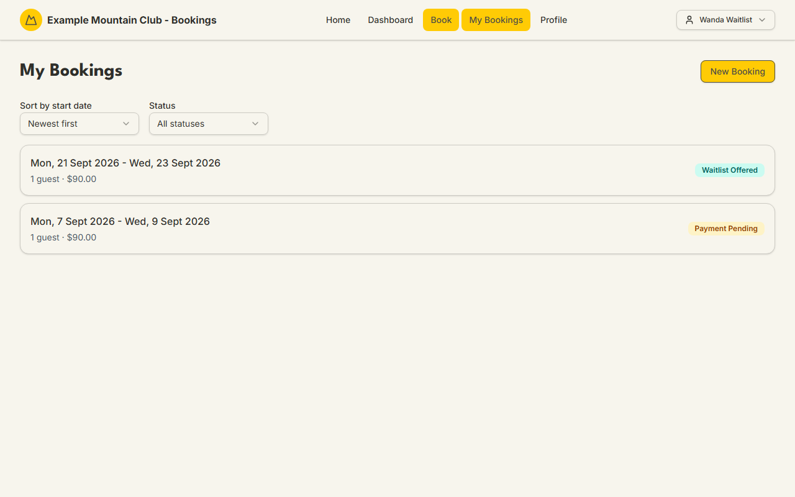

# Booking a stay

Audience: Member, Guest

## What it is

The booking wizard where you choose your lodge nights, add everyone in your
party, and confirm. Members start at **Book** in the top navigation (`/book`);
guests without a login can instead request a booking (see
[Guests without a login](#guests-without-a-login) below). The wizard runs in four
steps — **1. Select Dates → 2. Add Guests → 3. Review & Confirm → 4. Pay** — and
the last step becomes **Admin Review** for a booking that needs committee
sign-off (for example one that includes minors).

To book at **member rates** your membership subscription must be paid up. The
full booking state machine is in
[`STATE_MACHINES.md`](../STATE_MACHINES.md#booking-lifecycle).

## When you'd use it

- You want to stay at the lodge on specific nights.
- You are bringing family or friends — some members, some not.
- You are organising a trip and want others to book their own beds on the same
  dates (a group trip).
- The nights you want are full and you want to join the waitlist instead (see
  [The waitlist & offers](waitlist-and-offers.md)).

## Step-by-step

### 1. Select your dates

1. Click **Book** in the top navigation (`/book`). The wizard opens on **Select
   Dates**.

   

2. Pick your **check-in** date, then your **check-out** date. Nights are NZ
   date-only lodge nights — a stay of "7 Sept — 9 Sept" is two nights (the 7th
   and the 8th).
3. Each night on the calendar is colour-coded by availability, with a legend
   below it: **Available** (more than 15 beds free), **Filling** (6–15 beds),
   **Nearly full** (1–5 beds), and **Full**. A small season marker (e.g. "W
   Winter 2026") shows which season's rates apply — rates differ by season.
4. If the nights you want are **Full**, you can join the waitlist instead of
   booking — see [The waitlist & offers](waitlist-and-offers.md).

### 2. Add your guests

1. Continue to **Add Guests**. **You are added to the party by default** — you
   can remove yourself if you are booking only for others.
2. Add each guest. A guest who is another club member can be added as a **member
   guest** (member rate, their own bed held). A guest who is not a member is a
   **non-member guest** (non-member rate).
3. If you type a non-member guest whose name matches someone in your own family
   group who can be booked as a linked member, the wizard offers a one-click
   **Add as member guest** suggestion — a suggestion only, never forced. Taking
   it books them at the member rate with a bed held (no provisional hold).
4. **Make this a group trip** (optional): tick it if you want other people to
   book their **own** beds on the same dates. You choose whether each person pays
   their own bill or you pay one combined bill, and you get a join code/link to
   share. Full detail is in
   [`UX_FLOW_MAP.md`](../UX_FLOW_MAP.md) (the "Group trip organiser" journey).

### 3. Review, confirm, and the hold policies

Step 3, **Review & Confirm**, shows your nights, your party, and the quote in
dollars before you commit. What happens to any **non-member guests** depends on
which of two booking policies your club runs. Operators call these policies
*First Paid, First In* and *Members First*, but you will **not** see those names
anywhere in the wizard — you only see their effect:

- **When First Paid, First In applies** (or when your stay is already inside the
  club's hold window): your whole party — members and non-members alike — is
  booked together and goes straight to normal payment. The submit button reads
  **Continue to Payment** when money is due.
- **When Members First applies** (your stay is far enough out that an enabled
  Members First hold will actually be created): your **member** places are booked
  and charged now, while your **non-member** guests are held **provisionally** — no
  bed is reserved for them yet. The review step spells this out (a "provisional
  guests" note): which guests are provisional, that today's charge covers only
  the member places, the separate guest-portion amount, and that it is "because
  your stay is more than N hold-days away". You also see a **"Only book if my
  guests can come"** choice, so you are never forced to take a member-only place
  if your guests might be bumped.

Under a Members First split, your non-member guests' portion is **auto-charged to
the same card around the hold deadline** if beds remain — otherwise those guests
are bumped and only your own place stands. Your booking-confirmed email repeats
the same provisional-guests note. See
[Paying for your stay](paying-for-your-stay.md#split-charges-for-non-member-guests)
for the money side, and the
[booking lifecycle](../STATE_MACHINES.md#booking-lifecycle) for the states.

### 4. Pay (or wait for review)

- If money is due and you are paying by card, the **Pay** step takes payment
  inside the wizard. If you close the wizard before paying, it is safe: your
  booking page keeps a **Complete Payment** card and an amber "Payment required"
  banner so you can finish later.
- If your booking needs committee sign-off, step 4 reads **Admin Review** instead
  and no payment is taken until it is approved.

Paying by card versus by internet banking is covered in
[Paying for your stay](paying-for-your-stay.md).

### After you book: My Bookings

Your bookings live at **My Bookings** (`/bookings`), sortable by start date and
filterable by status.

A provisional non-member guest created by a Members First split appears as an
**indented sub-row nested inside its parent member booking** — one card carrying
both the parent's and the guest's own status badges. Open the booking to see a
**Your non-member guests** section listing each guest, their status, dates,
count, and amount. Your dashboard's **Next Stay** card also shows a "how full for
your dates" occupancy meter.

## Guests without a login

You do not need to be a member to stay. From the sign-in page (`/login`) there
are two guest paths:

- **Request a booking without an account** — sends your request to the club, who
  reply with a secure quote link. You open it to review the price, options, and
  expiry, then **accept**, **cancel**, **ask a question**, or **request
  changes**. Accepting is how a guest confirms; the quote states when it expires.
- **Request a school group booking** — for a school or organisation trip. The
  club prices it and, closer to check-in, emails you a secure link to confirm
  each attendee's name for the lodge roster.

These flows are the "Public quote requester" and "School contact" journeys in
[`UX_FLOW_MAP.md`](../UX_FLOW_MAP.md); operators handle them with the
[Booking Requests](../guides/booking-requests.md) guide.

## What it costs / what to expect

| Thing | What to expect |
| --- | --- |
| Member rate | Available only while your membership subscription is paid up |
| Nights | NZ date-only lodge nights; the season sets the per-night rate |
| Capacity | A **Full** night cannot be booked — join the waitlist instead |
| One booking per member per night | You cannot hold two overlapping bookings for the same member night |
| Minimum stay | Some periods enforce a minimum number of nights (a club policy) |
| Non-member guests (Members First) | Held provisionally, charged around the hold deadline, bumped if no bed remains |
| Non-member guests (First Paid, First In) | Booked and paid with the rest of the party |
| Group trip | Each joiner holds their own bed; you choose each-pays-own or you pay one bill |

Prices are shown in dollars (formatted from the cents the club stores). The
policies behind minimum stay, group discount, and cancellation are set by the
club — see the operator [Booking Policies](../guides/booking-policies.md) guide
and [`DOMAIN_INVARIANTS.md`](../DOMAIN_INVARIANTS.md#booking-dates-and-capacity).

## Troubleshooting

| Symptom | Why it happens | What to do |
| --- | --- | --- |
| The nights you want are greyed out or "Full" | No beds free on those nights | Pick other nights, or join the [waitlist](waitlist-and-offers.md) |
| You are quoted the non-member rate | Your membership subscription is not paid up | Check your [subscription status](your-account.md#account-information); pay it, then re-quote |
| "You already have a booking for these nights" | A member cannot double-book the same night | Open the existing booking from **My Bookings** and [change it](changing-or-cancelling-a-booking.md) instead |
| The stay is blocked by a minimum-stay rule | That period has a minimum number of nights | Extend your stay to meet the minimum |
| You paid but the booking still says "Payment required" | The card step was closed before payment finished | Open the booking and use its **Complete Payment** card |
| Your non-member guests show as provisional | Your club runs the *Members First* policy (a name you never see in the wizard) and a hold applies to your stay | This is expected — their bed is charged/confirmed around the hold deadline; see [Paying](paying-for-your-stay.md#split-charges-for-non-member-guests) |

## Related links

- Back to the [Member & Guest Guide](README.md) and the
  [documentation hub](../README.md).
- Sibling guides: [Paying for your stay](paying-for-your-stay.md),
  [The waitlist & offers](waitlist-and-offers.md),
  [Changing or cancelling a booking](changing-or-cancelling-a-booking.md).
- Reference: the [booking lifecycle](../STATE_MACHINES.md#booking-lifecycle), the
  [booking dates & capacity invariants](../DOMAIN_INVARIANTS.md#booking-dates-and-capacity),
  and the [UX flow map](../UX_FLOW_MAP.md).
