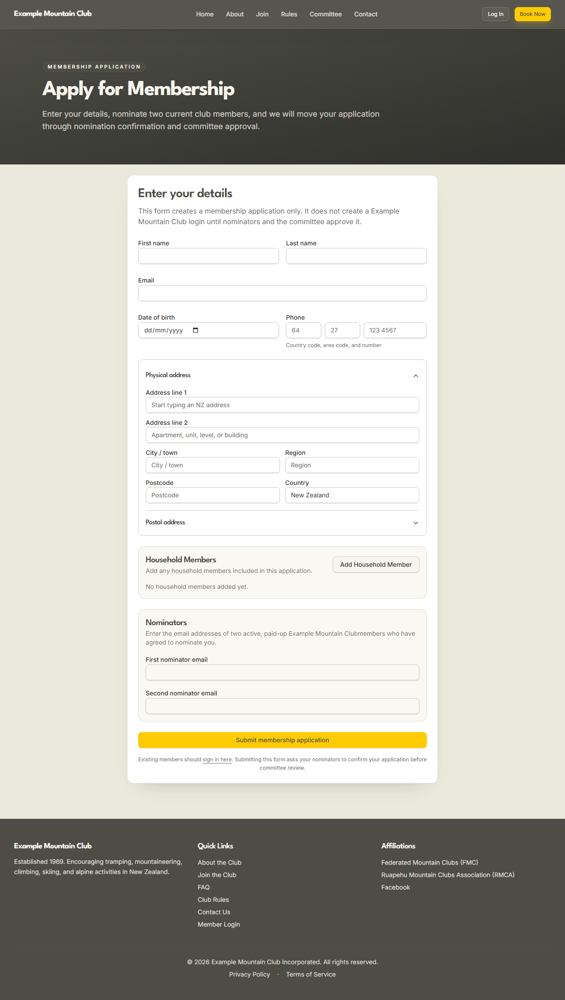
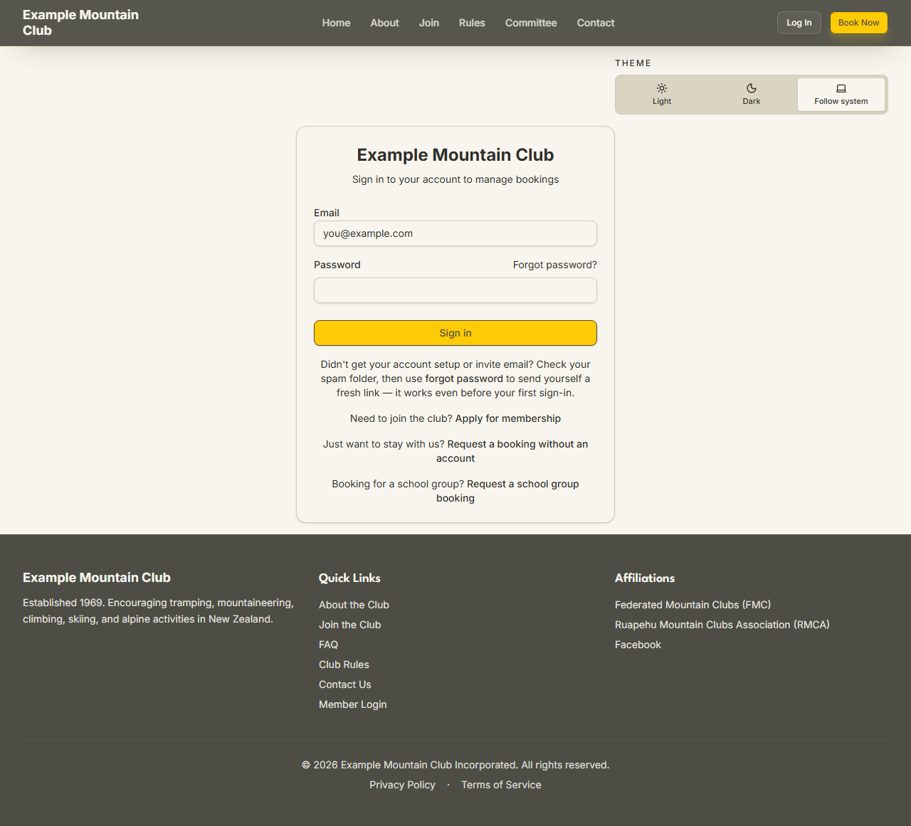
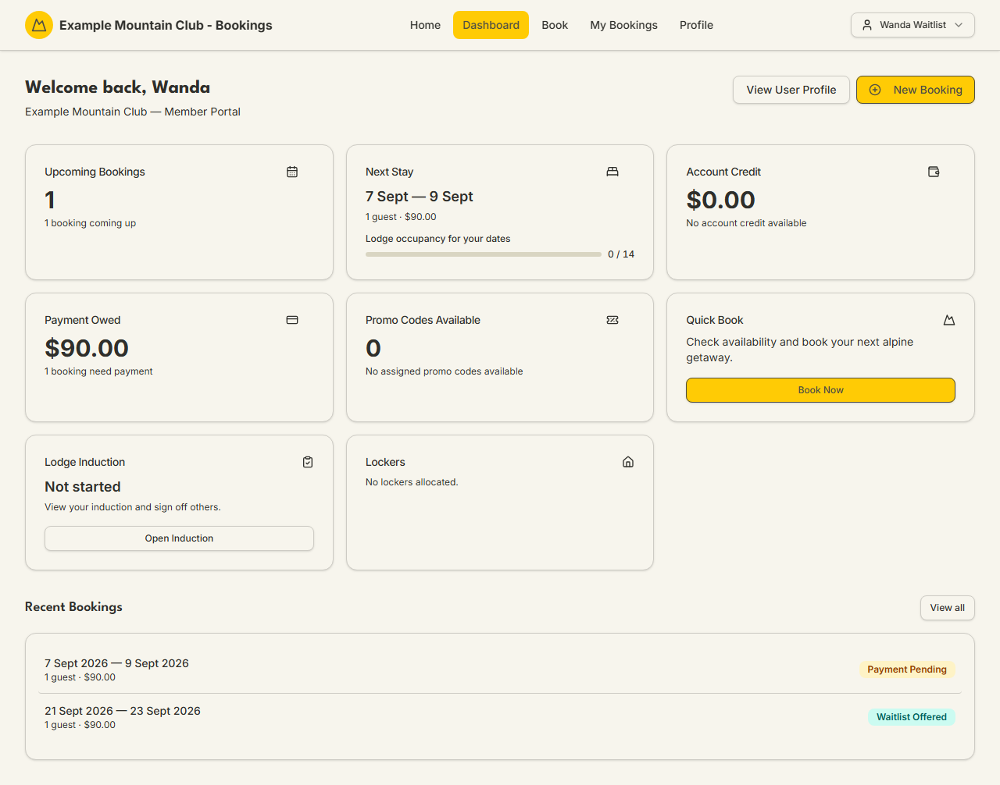

# Joining the club

Audience: Guest, Member

## What it is

How you go from "not a member" to signing in for the first time. You fill in one
application, name two current members as your nominators, they confirm you, the
committee reviews and approves, and then you set up a password and log in. Start
at **Join → Apply for Membership** on the public website (`/join/apply`).

Applying does **not** create a login. As the form says up front, it "creates a
membership application only. It does not create a … login until nominators and
the committee approve it." The full lifecycle is modelled in
[`STATE_MACHINES.md`](../STATE_MACHINES.md#membership-application-lifecycle).

## When you'd use it

- You want to become a member and book at member rates.
- Someone in your household is joining and you are adding them as a household
  member on one application.
- A previous application is stuck because a nominator has not confirmed yet.

## Step-by-step

### 1. Fill in the application

1. Open the website and choose **Join**, then **Apply for Membership**
   (`/join/apply`).

   

2. Enter your **First name**, **Last name**, **Email**, **Date of birth**, and
   **Phone** (country code, area code, and number). Your date of birth is used to
   work out your membership **age tier** (Adult / Youth / Child / Infant).
3. Enter your **Physical address** — start typing to use the New Zealand address
   lookup, or fill the fields in by hand if the lookup is unavailable. Add a
   separate **Postal address** only if it differs.
4. If others in your household are joining on the same application, click **Add
   Household Member** and add each infant, child, youth, or adult.

### 2. Name two nominators

1. In the **Nominators** section, enter the email addresses of **two active,
   paid-up members** who have agreed to nominate you (**First nominator email**
   and **Second nominator email**).
2. Click **Submit membership application**. The confirmation screen explains what
   happens next: each nominator is emailed a link to confirm, and the committee
   reviews your application once both have confirmed.

### 3. Your nominators confirm

Each nominator receives an email with a single-use confirmation link
(`/nominations/<token>`). They open it, sign in if needed, and confirm they are
nominating you. That page is deliberately exempt from the normal "confirm your
member details" prompt, so a nominator with an incomplete profile can still
confirm you. If a nominator's email never arrives, ask them to check their spam
folder — the club office can re-send the link, and the workflow can also swap in
a different nominator if one cannot confirm. The nomination states are in
[`STATE_MACHINES.md`](../STATE_MACHINES.md#nomination-lifecycle).

### 4. The committee approves, then you set up your login

Once both nominators have confirmed, the committee reviews your application and
approves or declines it. On approval you are emailed an **account-setup link** to
choose your password. Follow it, set your password, and you are taken to sign in.

### 5. First sign-in

1. Go to **Log In** (`/login`) and sign in with your email and the password you
   set.

   

2. If the club requires two-factor authentication, you are guided to set it up on
   first sign-in — see [Managing your account](your-account.md#two-factor-authentication-2fa).
3. You land on your **Dashboard**, your home base for bookings and account
   details — see [Booking a stay](booking-a-stay.md) to make your first booking.

   

## What to expect

| Step | What to expect |
| --- | --- |
| After you submit | You get a "submitted" confirmation on screen; no login exists yet. |
| Nominators | Both of your two nominators must confirm before the committee can review. Reminder emails go out automatically; there is a limit on how many. |
| Committee review | A club admin approves or declines. On approval a **joining fee** invoice may be raised (your club decides the amount; it is shown in dollars). |
| Account setup | You receive a setup link to choose your password. Setup links expire — if yours lapses, use **Forgot password** on the login page for a fresh one. |
| First login | You may be asked to set up two-factor authentication and to confirm your member details before you can book. |

Joining fees and how they are charged are the club's decision; see
[`AUTHORITATIVE_FEES.md`](../AUTHORITATIVE_FEES.md).

## Troubleshooting

| Symptom | Why it happens | What to do |
| --- | --- | --- |
| "Duplicate application" when you submit | An application already exists for your email | Contact the club office rather than submitting again |
| A nominator says their confirmation link is invalid or expired | The single-use token has been used or has lapsed | Ask the club office to re-send it, or nominate a different member |
| Your account-setup / invite email never arrived | It may be in spam, or the setup link has expired | Check spam, then use **Forgot password** on `/login` — it works even before your first sign-in |
| You can sign in but cannot book yet | Your profile still needs confirming, or your subscription is not yet paid | Complete the "confirm member details" prompt; check your [subscription status](your-account.md#account-information) on your profile |

## Related links

- Back to the [Member & Guest Guide](README.md) and the
  [documentation hub](../README.md).
- Sibling guides: [Managing your account](your-account.md),
  [Booking a stay](booking-a-stay.md).
- Reference: the
  [membership application lifecycle](../STATE_MACHINES.md#membership-application-lifecycle),
  the [nomination lifecycle](../STATE_MACHINES.md#nomination-lifecycle), and the
  [membership lifecycle invariants](../DOMAIN_INVARIANTS.md#membership-lifecycle).
  Operators review applications with the
  [Member Applications](../guides/member-applications.md) guide.
