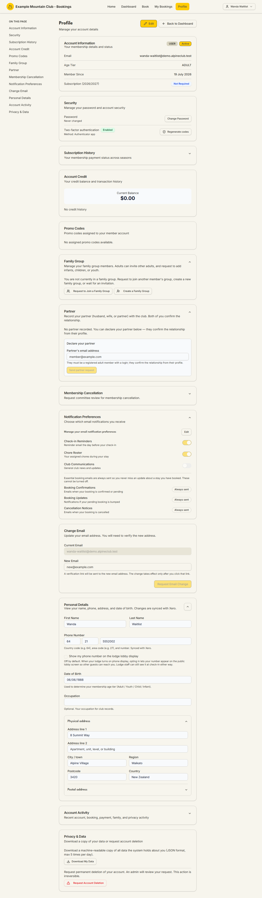

# Managing your account

Audience: Member

## What it is

Everything about **your** login and personal details: your profile, changing
your email or password, two-factor authentication, the alternative sign-in
methods, which emails you receive, and your privacy rights. It all lives on your
**Profile** (`/profile`), reached from **Profile** in the top navigation or the
**View User Profile** button on your dashboard.

The profile is one long page with an on-page section rail down the left. The
sign-in security lifecycles are in
[`STATE_MACHINES.md`](../STATE_MACHINES.md#two-factor-login-lifecycle).

## When you'd use it

- You need to change your email address or password.
- You are setting up (or re-generating recovery codes for) two-factor
  authentication.
- You want to sign in with an email link or with Google instead of a password.
- You want to change which club emails you receive.
- You want to download your data or request account deletion.

## Step-by-step

### Account information

Open **Profile**. The **Account Information** section at the top shows your
membership at a glance: your **email**, membership **type** (e.g. USER) and
status (e.g. Active), your **Age Tier** (Adult / Youth / Child / Infant), **Member
Since** date, and your **Subscription** status for the current season (for
example "Not Required", or a paid/unpaid state). Your subscription status is what
decides whether you book at member rates.

### Change your password

In the **Security** section, click **Change Password**. New passwords must meet
the club's current password policy (a minimum length and, optionally, required
character types), which the change form shows as live hints. The policy applies
when you set a password, never at login.

### Change your email

In the **Change Email** section, enter your **New email** and click **Request
Email Change**. A verification link is sent to the **new** address; the change
only takes effect after you click that link. Your current email keeps working
until then.

### Two-factor authentication (2FA)

In the **Security** section, **Two-factor authentication** shows whether it is
enabled and by which method (for example "Authenticator app"). Depending on your
club's policy you may be required to set it up on first sign-in.

- **Authenticator app (TOTP):** you scan a setup key into an authenticator app
  and enter the 6-digit code to enrol. You are shown **recovery codes** — save
  them somewhere safe; they are your way back in if you lose the app. Use
  **Regenerate codes** to issue a fresh set (the old ones stop working).
- **Email code:** where the club uses email-based 2FA, a code is emailed to you
  at sign-in.

The two-factor states are in
[`STATE_MACHINES.md`](../STATE_MACHINES.md#two-factor-login-lifecycle).

### Alternative sign-in methods

Your club may enable either or both of these in addition to password sign-in.
They appear on the sign-in page (`/login`) only when the club has turned them on,
so you may not see them:

- **Email me a sign-in link (magic link):** requests a single-use link emailed to
  you that signs you in at `/login/magic`. It is additive to password login, only
  works for active verified members, and still challenges 2FA. See the
  [magic-link lifecycle](../STATE_MACHINES.md#magic-link-sign-in-lifecycle).
- **Continue with Google:** signs you in with a Google account **you have
  linked** from your profile. You link it yourself in **Profile → Security →
  Connected accounts** (Connect Google), which does an OAuth round-trip to pin
  your Google account without switching your current session; you can unlink it
  there any time and keep password login. Google sign-in only ever matches a
  member by the Google account they linked — never by email, and it never creates
  an account. See the
  [Google sign-in lifecycle](../STATE_MACHINES.md#google-sign-in-lifecycle-profile-initiated-linking).

### Personal details

The **Personal Details** section holds your name, phone, date of birth,
occupation, and physical/postal address. These are **synced with Xero**, the
club's accounting system. Your date of birth sets your membership age tier. The
**Show my phone number on the lodge lobby display** option is off by default —
turn it on only if you are happy for your number to appear on the lodge's public
display screen (lodge staff can still see it at check-in either way).

### Notification preferences

The **Notification Preferences** section lets you turn optional emails on or off —
for example **Check-in Reminders**, **Chore Roster**, and **Club
Communications**. Essential booking emails (**Booking Confirmations**, **Booking
Updates**, **Cancellation Notices**) are marked **Always sent** and cannot be
turned off, so you never miss news about a stay you have booked.

### Privacy and data

The **Privacy & Data** section gives you two rights:

- **Download My Data** — a machine-readable (JSON) copy of the data the system
  holds about you, limited to a few downloads per day.
- **Request Account Deletion** — asks the club to permanently delete your
  account. This is **irreversible** and an admin reviews it first; on approval
  you are anonymised, your future bookings are cancelled, and your login is
  deactivated. You always receive a final privacy receipt when a deletion is
  approved.

## What to expect

| Action | What to expect |
| --- | --- |
| Change password | Applies immediately; must meet the club's live password policy |
| Change email | Verification link sent to the **new** address; effective only after you click it |
| Enrol in 2FA | You save recovery codes; regenerating them invalidates the old set |
| Magic link / Google | Only shown when the club enables them; both still respect 2FA |
| Notification preferences | Optional emails toggle; booking/cancellation emails are always sent |
| Download My Data | JSON export, capped to a few per day |
| Request account deletion | Reviewed by an admin; irreversible on approval; anonymises you and cancels future bookings |

## Troubleshooting

| Symptom | Why it happens | What to do |
| --- | --- | --- |
| Your new password is rejected | It does not meet the club's password policy | Read the live hints on the change form and try a stronger password |
| Your email change did not take effect | You have not clicked the verification link on the **new** address | Check the new inbox (and spam) and click the link |
| You lost your authenticator app | 2FA cannot generate a code | Use a saved **recovery code** to sign in, then regenerate codes; if you have none, contact the club office |
| You do not see "Email me a sign-in link" or "Continue with Google" | Your club has not enabled that method | Sign in with your password; ask the club if you expected it |
| "Trouble signing in? Reference: XXXXXXXX" on the login page | A server-side session failure bounced you back | Quote that reference code to an admin so they can find the recorded cause |
| Google sign-in is refused | No linked Google account, or the account is ineligible | Link Google first from **Profile → Security → Connected accounts**, then retry |

## Related links

- Back to the [Member & Guest Guide](README.md) and the
  [documentation hub](../README.md).
- Sibling guides: [Joining the club](joining-the-club.md) (first sign-in),
  [Managing your family & household](managing-your-family.md).
- Reference: the [two-factor](../STATE_MACHINES.md#two-factor-login-lifecycle),
  [magic-link](../STATE_MACHINES.md#magic-link-sign-in-lifecycle), and
  [Google sign-in](../STATE_MACHINES.md#google-sign-in-lifecycle-profile-initiated-linking)
  lifecycles, and the
  [membership lifecycle invariants](../DOMAIN_INVARIANTS.md#membership-lifecycle).
  Operators set the password policy with the
  [Login & Security](../guides/security.md) guide and handle deletion requests
  with the [Deletion Requests](../guides/deletion-requests.md) guide.
