# Xero Subsystem Architecture

This document maps the operational Xero integration: the ~50 `xero-*` modules
in `src/lib`, the database tables they own, the API routes and cron tasks that
drive them, and the dataflow through the three main flows (outbound documents,
inbound reconciliation, repair/hardening). It complements the repo-wide
[`docs/ARCHITECTURE.md`](../ARCHITECTURE.md) ("Xero integration layers"), which
lists the module boundaries; this document explains how the pieces move at
runtime.

Source of truth for behavior is always the code. This map was produced by the
2026-07 quality wave (issue #1128) and reflects the codebase at that date.

## Bird's-eye dataflow

```mermaid
flowchart LR
    subgraph Triggers
        BIZ[Booking / payment / refund /\nmembership flows]
        WH[Xero webhook\n/api/webhooks/xero]
        CRON[Cron\n/api/cron/xero?task=...]
        ADMIN[Admin UI\n/api/admin/xero/*]
        CLI[scripts/xero-booking-repair.ts]
    end

    subgraph Ledger [Reconciliation ledger &#40;Postgres&#41;]
        OPS[(XeroSyncOperation)]
        LINKS[(XeroObjectLink)]
        EVENTS[(XeroInboundEvent)]
        CURSORS[(XeroSyncCursor)]
        CACHES[(XeroContactCache /\nGroupCache / AdminCache)]
    end

    subgraph Workers
        OUTBOX[xero-operation-outbox\nprocessQueuedXeroOutboxOperations]
        RETRIES[xero-operation-queue\nprocessQueuedXeroOperationRetries]
        INBOUND[xero-inbound-reconciliation\nrunXeroInboundReconciliationCycle]
        REPAIR[xero-booking-repair\nrunBookingXeroRepair]
        HARDEN[xero-hardening\nbackfill / cleanup / report]
    end

    subgraph Infra [Infrastructure]
        CLIENT[xero-api-client\ncallXeroApi + withXeroRetry]
        TOKENS[xero-token-store\nencrypted tokens + refresh lease]
        OAUTH[xero-oauth\nconsent / callback / disconnect]
    end

    XERO[(Xero API)]

    BIZ -- enqueue + kick --> OPS
    WH -- store event --> EVENTS
    WH -- bounded kick --> INBOUND
    CRON --> OUTBOX & RETRIES & INBOUND & HARDEN
    ADMIN --> OPS & EVENTS & REPAIR
    CLI --> REPAIR

    OUTBOX -- claim PENDING --> OPS
    RETRIES -- claim REQUEUE --> OPS
    INBOUND -- claim RECEIVED/FAILED --> EVENTS
    INBOUND -- cursors --> CURSORS
    REPAIR -- plan/apply --> OPS

    OUTBOX & INBOUND & REPAIR & HARDEN --> CLIENT
    CLIENT --> TOKENS
    OAUTH --> TOKENS
    CLIENT <--> XERO
    XERO -- webhooks --> WH

    OUTBOX & INBOUND --> LINKS
    INBOUND --> CACHES
```



Two design rules shape everything below:

- **Every Xero side effect is a ledger row.** All outbound writes and inbound
  reconciliations run inside a `XeroSyncOperation` (started/completed/failed
  via `xero-sync.ts`), and every created/discovered Xero object is linked to a
  local record through `XeroObjectLink`. The admin diagnostics, health
  snapshots, repair tooling, and hardening reports are all queries over this
  ledger.
- **Provider calls stay out of business transactions.** Business flows never
  call Xero inline. They enqueue an outbox operation inside their own
  transaction and then *kick* the worker after commit
  (`kickQueuedXeroOutboxOperationsIfConnected`, ~20 call sites). Cron sweeps
  whatever the kicks missed.

## Module map

`src/lib/xero.ts` is a compatibility facade (re-exports only, no logic) for
external callers. New code should import the focused module. The subsystem's
own `src/lib/xero-*` modules must import the source domain module directly, not
the facade — an `eslint.config.mjs` `no-restricted-imports` override enforces
this (#1208). Shared JSON-guard micro-helpers (`asRecord`/`readString`/
`readNumber`) live in `xero-json`. The subsystem groups as:

### Infrastructure

| Module | Owns |
| --- | --- |
| `xero-config` | Reads/validates `XERO_CLIENT_ID`/`SECRET`/`REDIRECT_URI`/`ENCRYPTION_KEY` for the operational connection. |
| `xero-oauth` | Consent URL, OAuth callback (`handleXeroCallback`), client construction, disconnect (revoke + clear tokens). |
| `xero-oauth-state` | CSRF state cookie for the OAuth round-trip. |
| `xero-token-store` | AES-encrypted token persistence (`XeroToken` row), connection status, and the **refresh lease** (`claimXeroTokenRefreshLease`) so concurrent serverless instances don't double-refresh; losers wait for the lease deadline and re-read. |
| `xero-api-client` | `getAuthenticatedXeroClient` (refreshes under lease), `callXeroApi` (meters every call into `XeroApiUsageDaily`/`XeroApiUsageEvent`, observes the daily budget and process-local rate-limit cool-downs), `withXeroRetry` (in-process retry for 429/5xx/408), `XeroDailyLimitError`, `XeroTransientOutageError`. |
| `xero-api-usage` | Daily budget constant and usage recording/summary. |
| `xero-api-errors`, `xero-error-shape` | Error classification helpers (status code, body message, headers). |
| `xero-error-alert` | Ops email on sync errors, deduplicated to one per hour via `EmailLog`. |
| `xero-links`, `xero-record-links`, `xero-record-types` | Deep links into the Xero UI and into local admin pages; shared record-activity types. |
| `xero-feature-flags` | `XERO_ENABLE_DAILY_MEMBERSHIP_REFRESH`, `XERO_ENABLE_LIVE_MEMBER_GROUP_LOOKUPS`, `XERO_ENABLE_AUTOLOAD_XERO_CONTACT_GROUPS`. |
| `xero-organisation` | Cached financial-year-end month of the connected org. |

### Reconciliation ledger core

| Module | Owns |
| --- | --- |
| `xero-sync` | The ledger primitives: `startXeroSyncOperation` / `completeXeroSyncOperation` / `failXeroSyncOperation`, payload redaction + hashing, `buildXeroIdempotencyKey`, `upsertXeroObjectLink` (enforces single-active canonical links for Member CONTACT, Payment PRIMARY_INVOICE, MemberSubscription SUBSCRIPTION_INVOICE), `recordXeroInboundEvent`. |
| `xero-sync-cursors` | `XeroSyncCursor` read/write for incremental syncs, plus throttling helpers. |
| `xero-stale-operations` | Filters/counters for operations stuck in RUNNING and inbound events stuck in PROCESSING (feeds cron health and the admin reset/replay actions). |

### Outbound document pipeline

| Module | Owns |
| --- | --- |
| `xero-operation-outbox` | `enqueueXero*Operation` (12 queue types) and the worker `processQueuedXeroOutboxOperations`; also WAITING_PAYMENT release/reap for supplementary invoices. |
| `xero-operation-outbox-payload` | The 12 queue-type constants, payload schemas, and payload→expected-operation mapping used to claim rows safely. |
| `xero-operation-retry` | `retryXeroSyncOperation`: immediate replay of a failed operation (admin "Retry"), including contact-payload rebuild for member contact ops. |
| `xero-operation-queue` | Background replay: a REQUEUE `XeroSyncOperation` wraps the original id; `processQueuedXeroOperationRetries` claims and executes them via `retryXeroSyncOperation`. |
| `xero-booking-invoice-queue` | Thin helper: enqueue booking invoice + immediate kick, for callers that want one line. |
| `xero-booking-edit-settlement` | Classifies an admin booking edit into the right financial follow-up (update invoice / supplementary invoice / credit note) and queues it. |

### Financial document builders (called only by the outbox worker and repair)

| Module | Owns |
| --- | --- |
| `xero-booking-invoices` | Primary booking invoice create/update (`buildInvoiceLineItems`). |
| `xero-invoice-payments` | Recording Stripe payments against invoices and Stripe refunds as credit-note payments. |
| `xero-credit-notes` | Refund credit notes, unapplied (account-credit) credit notes, allocation to invoices. Stripe refunds settle **per delta** (#1162): a payment refunded in several steps gets one credit note per uncovered delta, keyed on a cumulative refunded-cents watermark; non-Stripe refunds keep one note per payment. |
| `xero-supplementary-invoices` | Positive booking-modification delta invoices. |
| `xero-modification-credit-notes` | Negative booking-modification credit notes. |
| `xero-entrance-fee-invoices` | One-off entrance-fee invoices per age tier. |
| `xero-group-settlement-invoices` | Combined ORGANISER_PAYS internet-banking invoice across joiner bookings. |
| `xero-invoice-helpers` | Shared date/allocation helpers for the six modules above. |
| `xero-mappings` | Account-code / item-code resolution from `XeroAccountMapping`/`XeroItemCodeMapping` (with legacy fallbacks), entrance-fee categorisation and idempotency keys. |

### Contacts and membership

| Module | Owns |
| --- | --- |
| `xero-contacts` | `findOrCreateXeroContact`, contact create/update, name normalisation/matching, and `retryXeroWriteWithContactRepair` (invoice writes retry once after repairing a stale contact link). |
| `xero-contact-cache` | `XeroContactCache` + per-contact group-membership cache primitives (no dependency on CRUD/bulk flows). |
| `xero-contact-groups` | Contact-group cache refresh, cache-backed reads, managed age-tier group sync. |
| `xero-bulk-contact-sync` | Cursor-driven incremental contact refresh from Xero (`syncContactsFromXero`). |
| `xero-member-import` | Creates local members from cached contacts in mapped groups. |
| `xero-duplicate-contacts`, `xero-contact-link-mismatches`, `xero-contact-sync` | Admin diagnostics: duplicate detection, link-mismatch snapshots, contact update payload builders. |
| `xero-membership-sync` | Subscription status per season derived from Xero invoices; incremental `refreshAllMembershipStatuses` driver. |

### Repair, hardening, admin

| Module | Owns |
| --- | --- |
| `xero-inbound-reconciliation` | Stored-event worker + per-entity reconcilers + incremental cursor reconciliation (see Flow 2). |
| `xero-booking-repair` | Booking-vs-Xero audit and self-repair (see Flow 3). CLI entry: `scripts/xero-booking-repair.ts`. Split into cohesive `xero-booking-repair-*` sub-modules (#1208 item 2, entry re-exports the public surface); see refactor item 2 for the module map. |
| `xero-hardening` | Historical `XeroObjectLink` backfill, stale canonical-link cleanup, the emailed reconciliation report, repeated-failure alerting. Split into cohesive `xero-hardening-*` sub-modules (#1208 item 5, entry re-exports the public surface); see refactor item 5 for the module map. |
| `xero-cron-runner` | Maps the 7 cron tasks to the workers above, records `CronJobRun` rows, gates on module + connection. |
| `xero-admin-failures`, `xero-admin-health`, `xero-record-activity`, `xero-admin-cache` | Admin overviews: failed-operation triage states, missing-invoice/missing-credit-note health snapshot, per-record activity timeline, cached chart-of-accounts/items. |

### HTTP surface

- `POST /api/webhooks/xero` — HMAC-verified event intake (Flow 2).
- `POST /api/cron/xero?task=memberships|outbox|retries|inbound|backfill|link-cleanup|report|all`
  — `CRON_SECRET`-gated; `all` runs the tasks in that order; `backfill` also
  runs `link-cleanup` by default. Tasks needing a connection are skipped (and
  recorded as SKIPPED) when Xero is disconnected or the `xeroIntegration`
  module is off.
- ~38 admin routes under `/api/admin/xero/**` and `/api/admin/members/[id]/xero-*`
  — OAuth connect/callback/disconnect, status/health/usage, operations list +
  retry/requeue/resolve/mark-non-replayable/reset-stale-running, inbound-events
  list + replay, contact tooling (search/import/sync/duplicates/mismatches),
  mappings, record activity.

## Data model

| Table | Role |
| --- | --- |
| `XeroToken` | Single-row encrypted OAuth token set + `refreshInProgressUntil` lease. |
| `XeroSyncOperation` | The ledger. `direction` INBOUND/OUTBOUND, `entityType`, `operationType`, optional `localModel`/`localId`, `idempotencyKey`, `correlationKey`, `replayable`, error fields, redacted request/response payloads, resulting Xero object identity, manual-resolution override fields. **Status machine:** `PENDING → RUNNING → SUCCEEDED | FAILED`, plus `WAITING_PAYMENT → PENDING` for supplementary invoices held until their Stripe payment settles. Claims are optimistic `updateMany` transitions, so concurrent workers cannot double-run a row. |
| `XeroObjectLink` | Local record ⇄ Xero object links with a `role` (e.g. `PRIMARY_INVOICE`, `REFUND_CREDIT_NOTE`, `CONTACT`, `ENTRANCE_FEE_INVOICE`) and `active` flag; unique on (local, xero, role). Canonical single-active scopes are enforced on upsert. |
| `XeroInboundEvent` | Stored webhook/admin events. **Status machine:** `RECEIVED → PROCESSING → PROCESSED | FAILED` (FAILED retried after a backoff; stale PROCESSING is operator-replayable). Unique `correlationKey` makes webhook delivery idempotent. |
| `ProcessedWebhookEvent` | Provider-scoped processing dedupe (`source`+`eventId` unique); the inbound worker claims a row before reconciling and releases it on failure. |
| `XeroSyncCursor` | Incremental checkpoints per (`resourceType`, `scope`) for contact/membership/invoice reconciliation. |
| `XeroContactCache`, `XeroContactGroupCache`, `XeroContactGroupMembershipCache` | Local snapshots of Xero contacts and group memberships (feed admin tooling, member import, group sync). |
| `XeroApiUsageDaily`, `XeroApiUsageEvent` | Metered API usage vs. the daily budget; rate-limit hit tracking. |
| `XeroAdminCache` | TTL cache of chart-of-accounts and items per tenant. |
| `XeroAccountMapping`, `XeroItemCodeMapping` | Operator-configured account/item code mappings resolved by `xero-mappings`. |

## Flow 1 — Outbound financial documents (the outbox)

Business flows that create money artefacts (booking paid, refund approved,
modification settled, membership cancellation approved, group settlement
raised, entrance fee due) enqueue an operation and kick the worker. Nothing
talks to Xero inside a business transaction.

```mermaid
sequenceDiagram
    autonumber
    participant BIZ as Business flow<br/>(booking-create, stripe-webhook-service,<br/>booking-cancel, refund admin, ...)
    participant OB as xero-operation-outbox
    participant DB as Postgres<br/>(XeroSyncOperation / XeroObjectLink)
    participant DOM as Document module<br/>(xero-booking-invoices, xero-credit-notes, ...)
    participant CT as xero-contacts
    participant API as xero-api-client
    participant XERO as Xero

    BIZ->>OB: enqueueXero*Operation(...)
    OB->>DB: existing-link / duplicate checks,<br/>INSERT op (PENDING or WAITING_PAYMENT,<br/>requestPayload.queueType, idempotency key)
    BIZ--)OB: kickQueuedXeroOutboxOperationsIfConnected({limit:1})<br/>(after commit; cron ?task=outbox sweeps the rest)

    Note over OB: Supplementary invoices held as WAITING_PAYMENT are released<br/>to PENDING by stripe-webhook-service when the payment settles;<br/>reapStaleWaitingPaymentXeroOutboxOperations fails them after 14 days.

    OB->>DB: claim: updateMany(id, status=PENDING,<br/>expected entity/operation) → RUNNING
    OB->>DOM: dispatch on queueType (12 types)
    DOM->>CT: findOrCreateXeroContact(member)
    CT->>API: callXeroApi(withXeroRetry(...))
    API->>XERO: create/search contact
    DOM->>API: create invoice / credit note / allocation<br/>(retryXeroWriteWithContactRepair on stale contact)
    API->>XERO: POST document
    XERO-->>DOM: document id / number
    opt Stripe already settled
        DOM->>XERO: record payment against invoice /<br/>credit-note payment for refunds
    end
    DOM->>DB: completeXeroSyncOperation(SUCCEEDED,<br/>redacted response, upsert XeroObjectLinks)
    alt failure
        DOM->>DB: failXeroSyncOperation(FAILED + error code/message)
        Note over DB: surfaced in admin failures overview;<br/>replayed via retry/requeue (below) or repair (Flow 3)
    end
```

The 12 queue types: entrance fee, booking invoice, booking invoice update,
refund credit note, account credit note, supplementary invoice, modification
credit note, modification account credit note, credit-note allocation,
membership-cancellation credit note, membership-cancellation contact update,
group-settlement invoice.

**Retry taxonomy** (each layer is distinct — do not conflate when changing):

1. **Transport** — `withXeroRetry` retries 429/5xx/408 in-process with backoff;
   `callXeroApi` meters usage and trips process-local cool-downs
   (`XeroDailyLimitError`, `XeroTransientOutageError`).
2. **Stale contact repair** — `retryXeroWriteWithContactRepair` repairs the
   member↔contact link once and retries the write.
3. **Operation replay** — a FAILED ledger row is never auto-retried by the
   outbox loop (it only claims PENDING). Admins either replay immediately
   (`retryXeroSyncOperation`) or queue a background REQUEUE wrapper
   (`enqueueXeroSyncOperationRetry` → `processQueuedXeroOperationRetries`,
   cron `?task=retries`).
4. **Inbound event retry** — FAILED `XeroInboundEvent` rows are re-swept after
   `XERO_INBOUND_FAILED_RETRY_BACKOFF_MS`; stale PROCESSING rows are
   operator-replayable.

## Flow 2 — Inbound reconciliation (webhooks + incremental cursors)

Xero pushes CONTACT and INVOICE events; the webhook stores them and returns
fast. Reconciliation happens in a bounded worker kicked after the response and
swept by cron. Internet-banking settlement rides this flow: when an invoice is
paid in Xero, the matching local payments/bookings are flipped here.

```mermaid
sequenceDiagram
    autonumber
    participant XERO as Xero
    participant WH as /api/webhooks/xero
    participant DB as Postgres<br/>(XeroInboundEvent / ProcessedWebhookEvent)
    participant W as xero-inbound-reconciliation
    participant REC as Per-entity reconcilers
    participant BIZ as Booking / payment / membership state

    XERO->>WH: POST events (HMAC signature)
    WH->>WH: verify HMAC-SHA256 (timing-safe), bound body/count
    loop each event
        WH->>DB: recordXeroInboundEvent(RECEIVED,<br/>unique correlationKey — duplicate-safe)
    end
    WH-->>XERO: 200 ok
    WH--)W: after(): runXeroInboundReconciliationCycle<br/>(batch ≤10, ≤3 batches; cron ?task=inbound sweeps)

    loop claimed events (RECEIVED, or FAILED past backoff)
        W->>DB: claim → PROCESSING; dedupe via ProcessedWebhookEvent
        W->>DB: startXeroSyncOperation(INBOUND, WEBHOOK_RECONCILE)
        W->>REC: processXeroInboundEvent(event)
        alt CONTACT
            REC->>BIZ: refresh contact cache + member link,<br/>managed group sync, membership backfill
        else INVOICE (paid)
            REC->>BIZ: syncInternetBankingPaymentsForPaidInvoice:<br/>flip IB payments → PAID, confirm booking,<br/>bed allocation, waitlist, emails
            REC->>BIZ: syncGroupSettlementForPaidInvoice:<br/>flip all joiner bookings on the organiser invoice
            REC->>BIZ: refresh linked subscriptions
        else PAYMENT / CREDIT-NOTE
            REC->>BIZ: reconcile payment / credit note:<br/>refund business-state repair,<br/>account-credit allocation repair
        end
        W->>DB: complete op + mark event PROCESSED<br/>(on error: FAILED + backoff, release dedupe claim)
    end

    Note over W: then cursor-driven incremental reconciliation<br/>(XeroSyncCursor + minimum intervals):
    W->>REC: contacts changed since cursor (syncContactsFromXero)
    W->>REC: membership invoices since cursor
    W->>REC: invoice reconciliation driver
```

Operator replay (`/api/admin/xero/inbound-events/[id]/replay`) deletes the
dedupe row, resets the event to RECEIVED, and reprocesses it synchronously —
allowed for FAILED/PROCESSED events and for PROCESSING events older than the
staleness threshold (dead-worker takeover).

## Flow 3 — Repair and hardening

Reconciliation heals what Xero tells us about; repair audits what we *should*
have told Xero. `runBookingXeroRepair` cross-checks bookings, payments,
modifications, the operation ledger, and object links, then plans and
(optionally) applies corrective actions — almost all of which are just new
outbox operations, so Flow 1 idempotency applies.

```mermaid
sequenceDiagram
    autonumber
    participant OP as Operator
    participant CLI as scripts/xero-booking-repair.ts<br/>(--dry-run / --apply / --booking / --from --to)
    participant REP as xero-booking-repair
    participant DB as Postgres
    participant OB as Outbox + retry workers

    OP->>CLI: run scoped repair
    CLI->>REP: runBookingXeroRepair(scope, {apply})
    REP->>DB: loadAuditData: bookings + payments +<br/>modifications + XeroSyncOperations + XeroObjectLinks
    REP->>REP: classify findings (13 codes:<br/>MISSING_PRIMARY_INVOICE, STALE_PRIMARY_INVOICE_DETAILS,<br/>CANCELLED_BOOKING_OPEN_INVOICE, XERO_AMOUNT_MISMATCH,<br/>BLOCKED_BY_XERO_OPERATION, ...)
    REP->>REP: plan actions (15 types; safe-to-auto-apply flag:<br/>QUEUE_* invoice/credit-note ops, REQUEUE_XERO_OPERATION,<br/>SYNC_*_LINK/FIELD, MARK_MANUAL_REVIEW)
    opt --apply
        loop up to 3 passes
            REP->>DB: apply safe actions (enqueue outbox ops,<br/>requeue failed ops, fix links/fields)
            REP->>OB: processQueuedXeroOutboxOperations +<br/>processQueuedXeroOperationRetries
            OB->>DB: execute, update ledger
            REP->>DB: re-audit; stop when clean
        end
    end
    REP-->>CLI: pass reports + human summary
```

Scheduled hardening (cron tasks, all idempotent):

- `backfill` — `backfillHistoricalXeroObjectLinks`: creates canonical
  `XeroObjectLink` rows for pre-ledger history (runs `link-cleanup` too).
- `link-cleanup` — `cleanupStaleCanonicalXeroObjectLinks`: deactivates
  superseded canonical links.
- `report` — `sendXeroReconciliationReport`: emailed issue digest (repeated
  failures, unsupported partials, stale pending, persistently-failing inbound
  events, link problems).
- Repeated-failure alerting (`maybeNotifyXeroRepeatedFailure`) and the
  once-per-hour error alert (`notifyXeroSyncError`) keep failure noise bounded.

Admin triage complements this: the failures overview groups FAILED operations
into actionable states (retryable, requeued, manually resolved,
non-replayable), the health snapshot lists paid bookings missing invoices and
refunds missing credit notes (flagged when the refunded amount still exceeds the
cents already covered by active refund credit notes, so multi-note refunds are
handled), and per-record activity shows the ledger for one booking/payment/member.

## OAuth and token lifecycle (supporting flow)

1. Admin hits `/api/admin/xero/connect` → consent URL with a signed state
   cookie (`xero-oauth-state`).
2. Xero redirects to `/api/admin/xero/callback` → `handleXeroCallback`
   validates state, exchanges the code, and `saveXeroTokens` encrypts
   access/refresh tokens with `XERO_ENCRYPTION_KEY` into the single `XeroToken`
   row (tenant id included).
3. Every worker call goes through `getAuthenticatedXeroClient`: if the access
   token is near expiry it claims the refresh lease
   (`refreshInProgressUntil`); the winner refreshes and persists, losers wait
   out the lease and re-read. This keeps serverless concurrency from burning
   refresh tokens.
4. `/api/admin/xero/disconnect` revokes and deletes tokens; workers then
   short-circuit via `isXeroConnected()` (cron records SKIPPED).

## Refactor opportunities (ranked)

Ranked by risk-reduction value; item 1 touches the most money-path logic.
These are candidates for future issues, not commitments.

1. **Split `xero-inbound-reconciliation.ts` (3,427 lines).** It contains five
   separable concerns: (a) stored-event worker mechanics (claim, dedupe,
   backoff, replay); (b) contact reconciler; (c) invoice/payment reconciler
   including the internet-banking settlement flip; (d) credit-note reconciler
   plus the two big business-state repair routines
   (`repairRefundedPaymentBusinessState`, ~260 lines;
   `repairAccountCreditAllocationBusinessState`, ~220 lines); (e) incremental
   cursor drivers. The settlement/repair code is the highest-risk money logic
   in the subsystem and currently the hardest to review in isolation.
2. **Split `xero-booking-repair.ts` (3,004 lines).** _Done (#1208 item 2):_
   the ~2,700 lines of private helpers were extracted verbatim (behavior
   preserving) into cohesive `xero-booking-repair-<phase>.ts` sub-modules —
   `-types`, `-deps`, `-utils`, `-payments`, `-object-resolution`, `-analysis`,
   `-findings`, `-classify`, `-load`, `-passes` — with an acyclic import graph
   (types/deps/utils are leaves; `classify` depends downward; the entry sits on
   top). `xero-booking-repair.ts` remains the entry (the `runBookingXeroRepair`
   orchestrator plus `formatBookingXeroRepairHumanSummary`) and re-exports the
   unchanged public surface. `classifyBookingContext` is a single sequential
   function that mutates its own local accumulators, so it stays whole in
   `-classify` (kept together, above the LOC soft cap, rather than editing the
   body). The private helpers still duplicate utilities elsewhere (JSON readers
   vs. `asRecord` copies in 4+ xero modules; `dollarsToCents` vs. shared money
   utils); de-duplicating them is deferred to item 6 to keep this split
   behavior-preserving.
3. **Make the outbox queue type first-class.** The PENDING query is a
   hand-written 12-branch `OR` over the `requestPayload.queueType` JSON path
   (unindexable), the dispatcher is a 12-way switch, and the 12 `enqueue*`
   functions repeat the same insert shape. A registry map
   (`queueType → {expectedOperation, handler}`) plus deriving the filter from
   the payload module's constant list removes three copies of the same
   knowledge; promoting `queueType` to an indexed column is the full fix but
   needs a migration (coordinate with schema owners).
4. **Unify the operation-replay stack.** `xero-operation-retry`,
   `xero-operation-queue`, and `xero-stale-operations` plus the
   claim-to-RUNNING `updateMany` pattern (duplicated in outbox and queue)
   describe one lifecycle across four files. A single operation-lifecycle
   module owning claim/complete/fail/requeue/stale semantics would shrink the
   surface admins and agents must understand.
5. **Split `xero-hardening.ts` (1,606 lines).** _Done (#1208 item 5):_ the
   private helpers were extracted verbatim (behavior preserving) into cohesive
   `xero-hardening-<concern>.ts` sub-modules with an acyclic import graph —
   `-types` (all public type contracts plus the two shared private
   record types) and `-shared` (the failure-window/scope-key helpers and the
   REQUEUE/threshold constants used by more than one concern) are leaves;
   `-canonical-links` (`cleanupStaleCanonicalXeroObjectLinks`),
   `-repeated-failure` (`maybeNotifyXeroRepeatedFailure`), `-report`
   (`buildXeroReconciliationReport` + `sendXeroReconciliationReport`, including
   the #1196 persistently-failing inbound-events section), and `-backfill`
   (`backfillHistoricalXeroObjectLinks`) each depend only on the two leaves.
   `xero-hardening.ts` remains the entry and re-exports the unchanged public
   surface (5 functions + 9 types) so `xero-cron-runner`, the admin
   link-maintenance route, `xero-sync`, and the tests resolve unchanged.
   `-report` stays above the LOC soft cap (~960 lines) because it is
   irreducible under this split's own rules: `buildXeroReconciliationReport` is
   a single ~610-line function that must stay whole (carving it would break
   behavior preservation), and its remaining report-only helpers
   (`groupRepeatedFailures`, the issue-item/URL builders, the age/cutoff
   helpers) and report-only `Pick` types are consumed nowhere else, so moving
   them out would force exporting private helpers rather than keeping them
   module-internal.
6. **De-duplicate micro-helpers.** _Partly done (#1208):_ the byte-identical
   `asRecord`/`readString`/`readNumber` guards that appeared in `xero-sync`,
   `xero-operation-queue`, `xero-operation-retry`, `xero-admin-failures`, and
   `xero-operation-outbox-payload` now import from the shared `xero-json`
   module. The differently-shaped `getJsonRecord` guards in
   `xero-inbound-reconciliation` remain local pending its own split. The
   `readJsonRecord`/`readJsonString`/`readJsonNumber` guards from
   `xero-booking-repair` now live (still local, NOT merged into `xero-json`) in
   its `xero-booking-repair-utils` sub-module after the item-2 split; merging
   them into `xero-json` is intentionally deferred to preserve behavior.
7. **Finish retiring the `xero.ts` facade inside the subsystem.** _Done
   (#1208):_ no `src/lib/xero-*` module imports the `@/lib/xero` facade anymore
   — each imports the source domain module directly, and an `eslint.config.mjs`
   `no-restricted-imports` override forbids the facade path from `xero-*` files
   to hold the boundary. The facade stays for external callers.
8. **Minor:** _Partly done (#1208):_ the `messageForTask` nested-ternary chain
   in `xero-cron-runner` is now a `switch`. The webhook route's per-category
   `if` blocks were kept — they emit real observability log lines, so dropping
   them would change log output rather than being no-ops.
